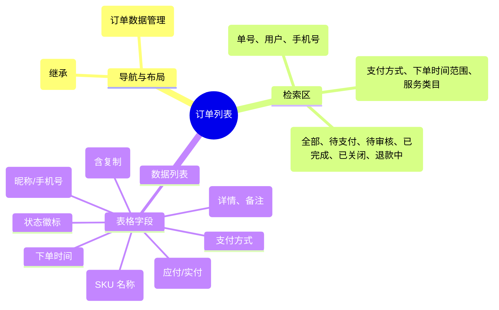

# 订单列表

## 0. 页面文档状态

- 文档版本：Release
- 生成日期：2026-05-13
- 来源文件：`product/release/product-sitemap-release.md`
- 页面ID：M-510
- 页面名称：订单列表
- 页面类型：列表
- 所属 Surface：后台管理端
- 匹配 Layout：`product-layout-release-admin-web.md` (Layout Key: admin-web)
- 页面模板：TPL-001 (管理端列表页模板)

## 1. 页面目标与上下文

### 1.1 页面目标

- 页面目的：提供全量订单的检索、筛选及详情查看入口，支撑日常的订单跟进与财务核对。
- 用户目标：通过订单号或客户手机号快速查找特定订单，或按状态批量查看待处理任务。
- 业务目标：实现订单数据的透明化管理，为运营决策提供基础数据支撑。
- 页面成功标准：列表查询的响应速度及筛选器的准确性。

### 1.2 页面入口与出口

| 类型 | 来源 / 去向 | 触发条件 | 传入 / 传出数据 | 备注 |
|---|---|---|---|---|
| 入口 | 订单管理中心 (M-500) | 点击统计项 | 状态过滤 |  |
| 入口 | 侧边导航 | 点击“订单列表” | 无 |  |
| 出口 | 订单详情 (M-520) | 点击单号或详情 | 订单 ID |  |

### 1.3 角色与权限

| 角色 | 是否可访问 | 权限条件 | 不满足时页面表现 |
|---|---|---|---|
| 运营管理员 / 客服 | 是 | 订单查询权限 | 提示无权限 |

### 1.4 全局页面属性

| 属性 | 类型 | 来源 | 默认值 | 影响元素 / 状态 | 说明 |
|---|---|---|---|---|---|
| filter_status | enum | query | "all" | 列表数据 |  |
| filter_payment | enum | select | "all" | 列表数据 | 线上 / 线下 / 全部 |

## 2. 页面结构思维导图

## 3. 页面布局与内容区块

| 区块ID | 区块名称 | 区块类型 | 展示条件 | 包含元素ID | 布局 / 样式定义 | 数据来源 |
|---|---|---|---|---|---|---|
| S-001 | 列表状态切换 | header | 总是显示 | E-001 | 水平 Tab 切换 | - |
| S-002 | 组合搜索与筛选 | header | 总是显示 | E-002 | 多行表单收纳 | - |
| S-003 | 订单数据表格 | content | 总是显示 | E-003, E-004 | 标准中台表格 | API-001 |

## 4. 页面元素清单

| 元素ID | 元素名称 | 元素类型 | 所属区块 | 是否必需 | 展示条件 | 默认文案 / 内容 | 样式定义 | 数据绑定 |
|---|---|---|---|---|---|---|---|---|
| E-001 | 订单状态 Tab | tab | S-001 | 是 | 总是显示 | 全部 / 待支付 / ... | 品牌激活样式 | filter_status |
| E-002 | 关键词搜索 | input | S-002 | 是 | 总是显示 | 订单号/手机号/姓名 | - | search_key |
| E-003 | 订单列表表格 | table | S-003 | 是 | 有数据 | - | - | order_list |
| E-004 | 详情跳转按钮 | button | S-003 | 是 | 总是显示 | 详情 | 蓝色文字 | - |

## 5. 元素状态矩阵

| 元素ID | 状态 | 触发条件 | 状态来源 | 样式定义 | 可执行动作 | 禁止动作 | 提示文案 / 反馈 | 恢复条件 |
|---|---|---|---|---|---|---|---|---|
| E-003 | 加载中 | 切换状态或搜索时 | - | loading | - | - | 正在查询订单... | 接口成功 |
| E-001 | 待办红点 | 有待审核线下支付 | - | badge | - | - | {n} | 审核后消失 |

## 6. 交互 Action 与执行效果

| ActionID | 触发元素ID | 交互名称 | 用户动作 | 前置条件 | 校验规则 | 执行动作 | 成功结果 | 失败结果 | 页面跳转 / 状态变化 | 埋点事件ID | 埋点事件名称 | 不埋点原因 |
|---|---|---|---|---|---|---|---|---|---|---|---|---|
| ACT-001 | E-001 | 状态切换 | 点击 Tab | - | - | 刷新列表数据 | - | - | URL 参数同步 | - | - | 基础筛选 |
| ACT-002 | E-004 | 进入详情 | 点击 | - | - | 导航 | - | - | 跳转 M-520 | - | - | 基础跳转 |

## 7. 埋点事件统计设计

### 7.1 埋点事件总表

| 埋点事件ID | 事件名称 | 事件类型 | 关联元素ID / ActionID | 触发时机 | 统计次数口径 | 去重规则 | 上报时机 | 关键属性 | 成功 / 失败归归因 | 漏斗阶段 |
|---|---|---|---|---|---|---|---|---|---|---|
| EVT-001 | 订单列表曝光 | page_view | - | 页面进入 | 每会话 1 次 | sessionId | 实时 | filter_status | - | - |

## 8. 数据结构与接口定义

### 8.1 页面数据模型

| 数据对象 | 字段 | 类型 | 必填 | 来源 | 默认值 | 使用位置 | 说明 |
|---|---|---|---|---|---|---|---|
| OrderListItem | id | string | 是 | API | - | E-003 |  |
| OrderListItem | user_info | string | 是 | API | - | E-003 | 昵称 + 手机号 |
| OrderListItem | sku_name | string | 是 | API | - | E-003 |  |
| OrderListItem | amount | number | 是 | API | 0.00 | E-003 |  |
| OrderListItem | status | string | 是 | API | - | E-003 | 文本及状态码 |

### 8.2 接口清单

| API ID | 接口名称 | 方法 | 路径 | 触发 ActionID | 请求数据结构 | 返回数据结构 | 成功处理 | 失败处理 |
|---|---|---|---|---|---|---|---|---|
| API-001 | 获取订单列表 | GET | /api/admin/orders/list | 页面加载 | {page, limit, filter_params} | {list, total} | 渲染表格 | - |

## 9. 边界状态与错误处理

| 场景ID | 场景类型 | 触发条件 | 页面表现 | 元素表现 | 用户可执行操作 | 系统处理 | 兜底文案 |
|---|---|---|---|---|---|---|---|
| EDGE-001 | 无数据状态 | 搜索无结果 | 展示空状态插画 | - | 清空筛选条件 | - | 暂无符合条件的订单 |

## 10. 多媒体与资源

| 资源ID | 资源类型 | 使用位置 | 说明 |
|---|---|---|---|
| 无 | - | - | - |
