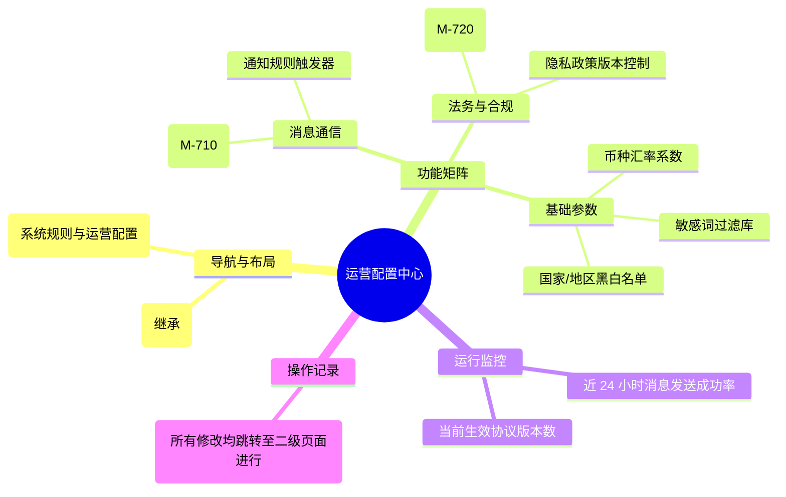

# 运营配置中心

## 0. 页面文档状态

- 文档版本：Release
- 生成日期：2026-05-13
- 来源文件：`product/release/product-sitemap-release.md`
- 页面ID：M-700
- 页面名称：运营配置中心
- 页面类型：导航中心
- 所属 Surface：后台管理端
- 匹配 Layout：`product-layout-release-admin-web.md` (Layout Key: admin-web)
- 页面模板：TPL-005 (管理端工作台/中心页模板)

## 1. 页面目标与上下文

### 1.1 页面目标

- 页面目的：作为平台底层规则、通用文本及法律协议的集中管理入口，支持运营人员通过可视化界面快速调整业务逻辑参数。
- 用户目标：快速定位并进入消息模版配置、协议更新或敏感词过滤等底层功能。
- 业务目标：降低系统维护的技术门槛，提升运营响应业务变化的速度（如法律协议更新）。
- 页面成功标准：配置项的检索效率。

### 1.2 页面入口与出口

| 类型 | 来源 / 去向 | 触发条件 | 传入 / 传出数据 | 备注 |
|---|---|---|---|---|
| 入口 | 侧边导航 | 点击“运营配置” | 无 |  |
| 出口 | 消息模板配置 (M-710) | 点击对应卡片 | 无 |  |
| 出口 | 协议管理 (M-720) | 点击对应卡片 | 无 |  |

### 1.3 角色与权限

| 角色 | 是否可访问 | 权限条件 | 不满足时页面表现 |
|---|---|---|---|
| 系统管理员 / 高级运营 | 是 | 系统配置管理权限 | 提示无权限 |

### 1.4 全局页面属性

| 属性 | 类型 | 来源 | 默认值 | 影响元素 / 状态 | 说明 |
|---|---|---|---|---|---|
| ops_stats | object | API | - | 汇总数据展示 |  |

## 2. 页面结构思维导图

## 3. 页面布局与内容区块

| 区块ID | 区块名称 | 区块类型 | 展示条件 | 包含元素ID | 布局 / 样式定义 | 数据来源 |
|---|---|---|---|---|---|---|
| S-001 | 配置功能导航 | content | 总是显示 | E-001 | 3-4 列网格卡片 | - |
| S-002 | 配置运行摘要 | side | 总是显示 | E-002 | 侧边统计列表 | API-001 |
| S-003 | 最近变更日志 | footer | 总是显示 | E-003 | 时间轴展示 | API-002 |

## 4. 页面元素清单

| 元素ID | 元素名称 | 元素类型 | 所属区块 | 是否必需 | 展示条件 | 默认文案 / 内容 | 样式定义 | 数据绑定 |
|---|---|---|---|---|---|---|---|---|
| E-001 | 功能导航卡片 | card | S-001 | 是 | 总是显示 | 消息模版配置 / ... | 阴影悬浮效果 | - |
| E-002 | 运行指标看板 | list | S-002 | 是 | 总是显示 | 总发送消息: {n} | 迷你统计项 | ops_stats |
| E-003 | 变更日志列表 | table | S-003 | 是 | 总是显示 | - | 紧凑型 | config_logs |

## 5. 元素状态矩阵

| 元素ID | 状态 | 触发条件 | 状态来源 | 样式定义 | 可执行动作 | 禁止动作 | 提示文案 / 反馈 | 恢复条件 |
|---|---|---|---|---|---|---|---|---|
| E-001 | 权限受限 | 无特定子项权限 | - | 置灰且带锁图标 | - | 点击 | 暂无该子项管理权限 | - |

## 6. 交互 Action 与执行效果

| ActionID | 触发元素ID | 交互名称 | 用户动作 | 前置条件 | 校验规则 | 执行动作 | 成功结果 | 失败结果 | 页面跳转 / 状态变化 | 埋点事件ID | 埋点事件名称 | 不埋点原因 |
|---|---|---|---|---|---|---|---|---|---|---|---|---|
| ACT-001 | E-001 | 进入子功能 | 点击卡片 | 有权限 | - | 导航 | - | - | 跳转对应 M 系列页面 | - | - | 基础导航 |

## 7. 埋点事件统计设计

### 7.1 埋点事件总表

| 埋点事件ID | 事件名称 | 事件类型 | 关联元素ID / ActionID | 触发时机 | 统计次数口径 | 去重规则 | 上报时机 | 关键属性 | 成功 / 失败归因 | 漏斗阶段 |
|---|---|---|---|---|---|---|---|---|---|---|
| EVT-001 | 运营中心曝光 | page_view | - | 页面进入 | 每会话 1 次 | sessionId | 实时 | - | - | - |

## 8. 数据结构与接口定义

### 8.1 页面数据模型

| 数据对象 | 字段 | 类型 | 必填 | 来源 | 默认值 | 使用位置 | 说明 |
|---|---|---|---|---|---|---|---|
| OpsStats | msg_sent_today | number | 是 | API | 0 | E-002 |  |
| OpsStats | active_agreements | number | 是 | API | 0 | E-002 |  |

### 8.2 接口清单

| API ID | 接口名称 | 方法 | 路径 | 触发 ActionID | 请求数据结构 | 返回数据结构 | 成功处理 | 失败处理 |
|---|---|---|---|---|---|---|---|---|
| API-001 | 获取运营配置概览 | GET | /api/admin/ops/summary | 页面加载 | - | {OpsStats} | 渲染侧边栏 | - |
| API-002 | 获取配置变更日志 | GET | /api/admin/ops/logs | 页面加载 | {limit} | {logs} | 渲染日志表 | - |

## 9. 边界状态与错误处理

| 场景ID | 场景类型 | 触发条件 | 页面表现 | 元素表现 | 用户可执行操作 | 系统处理 | 兜底文案 |
|---|---|---|---|---|---|---|---|
| EDGE-001 | 接口超时 | 获取日志失败 | 显示重试按钮 | - | 点击重试 | - | 配置日志加载失败 |

## 10. 多媒体资源

| 资源ID | 资源类型 | 使用位置 | 说明 |
|---|---|---|---|
| 无 | - | - | - |
