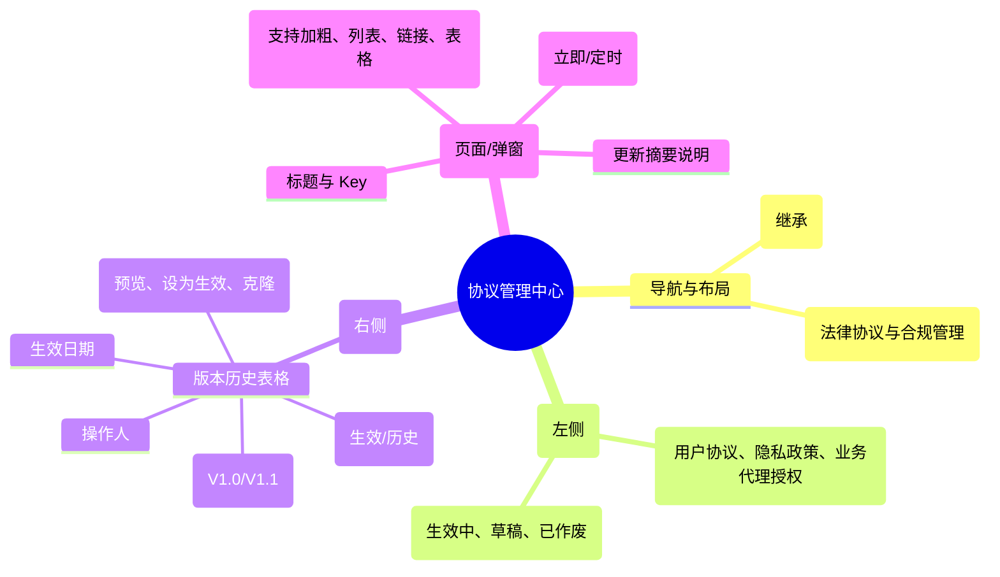

# 协议管理

## 0. 页面文档状态

- 文档版本：Release
- 生成日期：2026-05-13
- 来源文件：`product/release/product-sitemap-release.md`
- 页面ID：M-720
- 页面名称：协议管理
- 页面类型：列表与版本控制
- 所属 Surface：后台管理端
- 匹配 Layout：`product-layout-release-admin-web.md` (Layout Key: admin-web)
- 页面模板：TPL-001 (管理端列表/配置页模板)

## 1. 页面目标与上下文

### 1.1 页面目标

- 页面目的：集中管理平台所有对外的法律文件（如隐私政策、用户服务协议、特定业务委任书），支持多版本并行开发与平滑切换，并记录客户签署的版本历史。
- 用户目标：起草新版协议，预览生效效果，并在指定日期一键替换全平台生效版本。
- 业务目标：确保平台法律条款的严谨性与更新效率，满足合规审计要求。
- 页面成功标准：协议版本切换的无误性及签署日志的完整性。

### 1.2 页面入口与出口

| 类型 | 来源 / 去向 | 触发条件 | 传入 / 传出数据 | 备注 |
|---|---|---|---|---|
| 入口 | 运营配置中心 (M-700) | 点击“协议管理” | 无 |  |
| 出口 | 协议编辑页面 | 点击“编辑” | 协议 ID + 版本号 |  |

### 1.3 角色与权限

| 角色 | 是否可访问 | 权限条件 | 不满足时页面表现 |
|---|---|---|---|
| 法务人员 / 运营总监 | 是 | 协议管理权限 | 提示无权限 |

### 1.4 全局页面属性

| 属性 | 类型 | 来源 | 默认值 | 影响元素 / 状态 | 说明 |
|---|---|---|---|---|---|
| active_version | string | API | - | 列表高亮显示 |  |

## 2. 页面结构思维导图

## 3. 页面布局与内容区块

| 区块ID | 区块名称 | 区块类型 | 展示条件 | 包含元素ID | 布局 / 样式定义 | 数据来源 |
|---|---|---|---|---|---|---|
| S-001 | 协议类型选择 | side-panel | 总是显示 | E-001 | 宽度 240px，垂直菜单 | API-001 |
| S-002 | 版本历史列表 | content | 选中协议类型时 | E-002, E-003 | 标准表格展示 | API-002 |
| S-003 | 协议正文编辑器 | modal/page | 点击新建/编辑时 | E-004, E-005 | 富文本编辑器 + 配置项 | - |

## 4. 页面元素清单

| 元素ID | 元素名称 | 元素类型 | 所属区块 | 是否必需 | 展示条件 | 默认文案 / 内容 | 样式定义 | 数据绑定 |
|---|---|---|---|---|---|---|---|---|
| E-001 | 协议类型菜单 | menu | S-001 | 是 | 总是显示 | - | - | agreement_types |
| E-002 | 版本历史表格 | table | S-002 | 是 | 总是显示 | - | - | version_history |
| E-003 | + 新建版本 | button | S-002 | 是 | 总是显示 | 新增协议版本 | 品牌色 | - |
| E-004 | 富文本编辑器 | other | S-003 | 是 | 总是显示 | [Quill/Editor 占位] | - | agreement.content |
| E-005 | 生效日期选择 | datepicker | S-003 | 是 | 总是显示 | 默认立即生效 | - | active_date |

## 5. 元素状态矩阵

| 元素ID | 状态 | 触发条件 | 状态来源 | 样式定义 | 可执行动作 | 禁止动作 | 提示文案 / 反馈 | 恢复条件 |
|---|---|---|---|---|---|---|---|---|
| E-002 | 生效标记 | version.is_active == true | - | 绿色 Tag | - | - | 已发布并生效 | - |
| E-004 | 修改中 | 内容变更未保存 | - | - | 保存草稿 | 页面刷新 | 您有未保存的内容 | 点击保存 |

## 6. 交互 Action 与执行效果

| ActionID | 触发元素ID | 交互名称 | 用户动作 | 前置条件 | 校验规则 | 执行动作 | 成功结果 | 失败结果 | 页面跳转 / 状态变化 | 埋点事件ID | 埋点事件名称 | 不埋点原因 |
|---|---|---|---|---|---|---|---|---|---|---|---|---|
| ACT-001 | E-003 | 创建新版本 | 点击 | - | - | 克隆最新生效版内容 | 进入编辑态 | - | - | - | - | 基础操作 |
| ACT-002 | E-006 | 发布生效 | 点击确认 | 必须填写更新摘要 | - | 调用发布 API (API-003) | 全平台版本更新 | 报错提示 | 列表状态变更 | EVT-002 | 协议版本发布 | - |

## 7. 埋点事件统计设计

### 7.1 埋点事件总表

| 埋点事件ID | 事件名称 | 事件类型 | 关联元素ID / ActionID | 触发时机 | 统计次数口径 | 去重规则 | 上报时机 | 关键属性 | 成功 / 失败归因 | 漏斗阶段 |
|---|---|---|---|---|---|---|---|---|---|---|
| EVT-001 | 协议配置页曝光 | page_view | - | 页面进入 | 每会话 1 次 | sessionId | 实时 | total_agreements | - | - |
| EVT-002 | 协议正式生效 | action | ACT-002 | 接口成功 | 每次触发 1 次 | - | 实时 | agreement_id, version | - | 业务更新 |

## 8. 数据结构与接口定义

### 8.1 页面数据模型

| 数据对象 | 字段 | 类型 | 必填 | 来源 | 默认值 | 使用位置 | 说明 |
|---|---|---|---|---|---|---|---|
| AgreementType | id | string | 是 | API | - | E-001 |  |
| AgreementType | name | string | 是 | API | - | E-001 |  |
| VersionItem | version_no | string | 是 | API | - | E-002 |  |
| VersionItem | is_active | boolean | 是 | API | false | E-002 |  |

### 8.2 接口清单

| API ID | 接口名称 | 方法 | 路径 | 触发 ActionID | 请求数据结构 | 返回数据结构 | 成功处理 | 失败处理 |
|---|---|---|---|---|---|---|---|---|
| API-001 | 获取协议类型列表 | GET | /api/admin/agreement/types | 页面加载 | - | {list} | 渲染侧边栏 | - |
| API-002 | 获取版本历史 | GET | /api/admin/agreement/versions | 切换协议 | {id} | {list} | 渲染表格 | - |
| API-003 | 发布新版本 | POST | /api/admin/agreement/publish | ACT-002 | {id, content, date} | {success} | 刷新列表并提示 | 校验失败 |

## 9. 边界状态与错误处理

| 场景ID | 场景类型 | 触发条件 | 页面表现 | 元素表现 | 用户可执行操作 | 系统处理 | 兜底文案 |
|---|---|---|---|---|---|---|---|
| EDGE-001 | 定时生效冲突 | 已存在定时生效的版本 | 提示无法覆盖 | - | 修改现有定时版本 | - | 已存在计划在 {date} 生效的版本，请先作废该计划。 |

## 10. 多媒体与资源

| 资源ID | 资源类型 | 使用位置 | 说明 |
|---|---|---|---|
| 无 | - | - | - |
