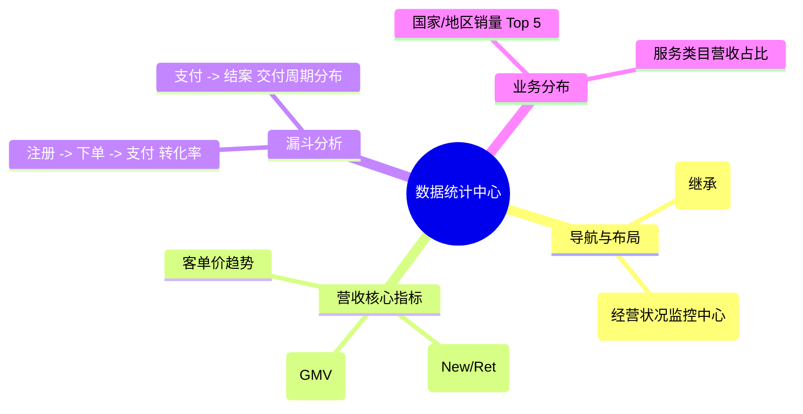

# 数据统计中心

## 0. 页面文档状态

- 文档版本：Release
- 生成日期：2026-05-13
- 来源文件：`product/release/product-sitemap-release.md`
- 页面ID：M-800
- 页面名称：数据统计中心
- 页面类型：看板
- 所属 Surface：后台管理端
- 匹配 Layout：`product-layout-release-admin-web.md` (Layout Key: admin-web)
- 页面模板：TPL-005 (管理端工作台/中心页模板)

## 1. 页面目标与上下文

### 1.1 页面目标

- 页面目的：提供全平台的经营数据监控、漏斗转化分析及核心指标看板，支持通过图形化界面发现业务增长点及交付瓶颈。
- 用户目标：查看本月 GMV 完成进度、各国家服务占比及销售转化率趋势。
- 业务目标：通过数据驱动决策，优化商品结构及专家排班，提升整体盈利能力。
- 页面成功标准：看板数据的实时性（分钟级刷新）及关键指标的展示清晰度。

### 1.2 页面入口与出口

| 类型 | 来源 / 去向 | 触发条件 | 传入 / 传出数据 | 备注 |
|---|---|---|---|---|
| 入口 | 侧边导航 | 点击“数据统计” | 无 |  |
| 出口 | 销售与服务统计 (M-810) | 点击指标详情 | 时间维度 / 维度 ID |  |

### 1.3 角色与权限

| 角色 | 是否可访问 | 权限条件 | 不满足时页面表现 |
|---|---|---|---|
| CEO / 运营总监 / 财务主管 | 是 | 全量数据查看权限 | 提示无权限 |

### 1.4 全局页面属性

| 属性 | 类型 | 来源 | 默认值 | 影响元素 / 状态 | 说明 |
|---|---|---|---|---|---|
| date_range | array | daterange | [today-30, today] | 所有图表 |  |

## 2. 页面结构思维导图

## 3. 页面布局与内容区块

| 区块ID | 区块名称 | 区块类型 | 展示条件 | 包含元素ID | 布局 / 样式定义 | 数据来源 |
|---|---|---|---|---|---|---|
| S-001 | 经营核心看板 | header | 总是显示 | E-001 | 4 列大数据卡片 | API-001 |
| S-002 | 趋势与分布图表 | content | 总是显示 | E-002, E-003 | 两列布局 (趋势图+饼图) | API-002 |

## 4. 页面元素清单

| 元素ID | 元素名称 | 元素类型 | 所属区块 | 是否必需 | 展示条件 | 默认文案 / 内容 | 样式定义 | 数据绑定 |
|---|---|---|---|---|---|---|---|---|
| E-001 | 指标汇总项 | list | S-001 | 是 | 总是显示 | GMV: {n} (↑5%) | 绿色/红色升降标 | main_stats |
| E-002 | 营收走势图 | other | S-002 | 是 | 总是显示 | [折线图] | - | sales_trend |
| E-003 | 地区分布饼图 | other | S-002 | 是 | 总是显示 | [饼图] | - | region_dist |

## 5. 元素状态矩阵

| 元素ID | 状态 | 触发条件 | 状态来源 | 样式定义 | 可执行动作 | 禁止动作 | 提示文案 / 反馈 | 恢复条件 |
|---|---|---|---|---|---|---|---|---|
| - | - | - | - | - | - | - | - | - |

## 6. 交互 Action 与执行效果

| ActionID | 触发元素ID | 交互名称 | 用户动作 | 前置条件 | 校验规则 | 执行动作 | 成功结果 | 失败结果 | 页面跳转 / 状态变化 | 埋点事件ID | 埋点事件名称 | 不埋点原因 |
|---|---|---|---|---|---|---|---|---|---|---|---|---|
| ACT-001 | E-001 | 查看趋势详情 | 点击卡片 | - | - | 导航 | - | - | 跳转 M-810 | - | - | 基础跳转 |

## 7. 埋点事件统计设计

### 7.1 埋点事件总表

| 埋点事件ID | 事件名称 | 事件类型 | 关联元素ID / ActionID | 触发时机 | 统计次数口径 | 去重规则 | 上报时机 | 关键属性 | 成功 / 失败归因 | 漏斗阶段 |
|---|---|---|---|---|---|---|---|---|---|---|
| EVT-001 | 数据中心曝光 | page_view | - | 页面进入 | 每会话 1 次 | sessionId | 实时 | date_range | - | - |

## 8. 数据结构与接口定义

### 8.1 页面数据模型

| 数据对象 | 字段 | 类型 | 必填 | 来源 | 默认值 | 使用位置 | 说明 |
|---|---|---|---|---|---|---|---|
| MainStats | gmv | number | 是 | API | 0.00 | E-001 |  |
| MainStats | pay_users | number | 是 | API | 0 | E-001 |  |

### 8.2 接口清单

| API ID | 接口名称 | 方法 | 路径 | 触发 ActionID | 请求数据结构 | 返回数据结构 | 成功处理 | 失败处理 |
|---|---|---|---|---|---|---|---|---|
| API-001 | 获取核心指标 | GET | /api/admin/analytics/main | 页面加载 | {date_range} | {MainStats} | 渲染看板 | - |
| API-002 | 获取营收趋势图 | GET | /api/admin/analytics/trend | 页面加载 | {date_range} | {ChartData} | 渲染图表 | - |

## 9. 边界状态与错误处理

| 场景ID | 场景类型 | 触发条件 | 页面表现 | 元素表现 | 用户可执行操作 | 系统处理 | 兜底文案 |
|---|---|---|---|---|---|---|---|
| EDGE-001 | 数据加载失败 | 接口报错 | 显示缺省页 | - | 点击重试 | - | 数据加载失败，请重试 |

## 10. 多媒体资源

| 资源ID | 资源类型 | 使用位置 | 说明 |
|---|---|---|---|
| M-001 | chart | S-002 | 营收走势折线图 |
