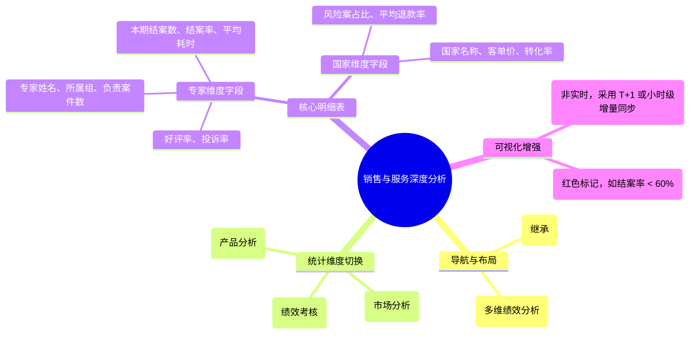

# 销售与服务统计

## 0. 页面文档状态

- 文档版本：Release
- 生成日期：2026-05-13
- 来源文件：`product/release/product-sitemap-release.md`
- 页面ID：M-810
- 页面名称：销售与服务统计
- 页面类型：深度分析列表
- 所属 Surface：后台管理端
- 匹配 Layout：`product-layout-release-admin-web.md` (Layout Key: admin-web)
- 页面模板：TPL-001 (管理端列表/配置页模板)

## 1. 页面目标与上下文

### 1.1 页面目标

- 页面目的：对销售业绩与服务交付效能进行下钻分析，提供按国家、专家、服务类目维度的详细数据列表，支撑绩效考核与资源调配。
- 用户目标：查看特定服务专家本月的结案数及平均好评率，或者对比不同国家的 SKU 销售转化差异。
- 业务目标：通过量化的绩效指标驱动交付团队提效，优化高价值国家/服务的资源投入。
- 页面成功标准：统计数据的准确性及多维筛选的灵活性。

### 1.2 页面入口与出口

| 类型 | 来源 / 去向 | 触发条件 | 传入 / 传出数据 | 备注 |
|---|---|---|---|---|
| 入口 | 数据统计中心 (M-800) | 点击详情 | 维度 ID / 时间范围 |  |
| 出口 | 案件总览 (M-610) | 点击专家姓名 | 专家 ID | 跳转查看该专家名下案件 |

### 1.3 角色与权限

| 角色 | 是否可访问 | 权限条件 | 不满足时页面表现 |
|---|---|---|---|
| 运营总监 / 财务 / 交付经理 | 是 | 绩效与经营统计权限 | 提示无权限 |

### 1.4 全局页面属性

| 属性 | 类型 | 来源 | 默认值 | 影响元素 / 状态 | 说明 |
|---|---|---|---|---|---|
| analysis_dim | enum | select | "expert" | 列表表头与数据 | 专家 / 国家 / 类目 |

## 2. 页面结构思维导图

## 3. 页面布局与内容区块

| 区块ID | 区块名称 | 区块类型 | 展示条件 | 包含元素ID | 布局 / 样式定义 | 数据来源 |
|---|---|---|---|---|---|---|
| S-001 | 维度与时间筛选 | header | 总是显示 | E-001, E-002 | 水平筛选组合 | - |
| S-002 | 绩效明细数据表 | content | 总是显示 | E-003 | 标准中台表格 | API-001 |
| S-003 | 统计摘要卡片 | footer | 总是显示 | E-004 | 3 列摘要 | API-001 |

## 4. 页面元素清单

| 元素ID | 元素名称 | 元素类型 | 所属区块 | 是否必需 | 展示条件 | 默认文案 / 内容 | 样式定义 | 数据绑定 |
|---|---|---|---|---|---|---|---|---|
| E-001 | 分析维度切换 | tab | S-001 | 是 | 总是显示 | 专家绩效 / 国家统计 | - | analysis_dim |
| E-002 | 时间范围选择 | daterange | S-001 | 是 | 总是显示 | 本月 | - | date_range |
| E-003 | 绩效统计表格 | table | S-002 | 是 | 有数据 | - | - | analytics_list |
| E-004 | 全局均值对照 | list | S-003 | 否 | 总是显示 | 全平台平均结案周期: 12d | 灰色小字 | global_avg |

## 5. 元素状态矩阵

| 元素ID | 状态 | 触发条件 | 状态来源 | 样式定义 | 可执行动作 | 禁止动作 | 提示文案 / 反馈 | 恢复条件 |
|---|---|---|---|---|---|---|---|---|
| E-003 | 预警状态 | 专家结案率 < 60% | item.rate < 0.6 | 红色文字 | - | - | 结案效率偏低 | - |

## 6. 交互 Action 与执行效果

| ActionID | 触发元素ID | 交互名称 | 用户动作 | 前置条件 | 校验规则 | 执行动作 | 成功结果 | 失败结果 | 页面跳转 / 状态变化 | 埋点事件ID | 埋点事件名称 | 不埋点原因 |
|---|---|---|---|---|---|---|---|---|---|---|---|---|
| ACT-001 | E-001 | 维度切换 | 点击 | - | - | 重新定义表格 Schema | 列表刷新 | - | - | - | - | 基础交互 |
| ACT-002 | E-003 | 查看关联案件 | 点击专家姓名 | 维度为专家 | - | 导航 | - | - | 跳转 M-610 | - | - | 业务联动 |

## 7. 埋点事件统计设计

### 7.1 埋点事件总表

| 埋点事件ID | 事件名称 | 事件类型 | 关联元素ID / ActionID | 触发时机 | 统计次数口径 | 去重规则 | 上报时机 | 关键属性 | 成功 / 失败归因 | 漏斗阶段 |
|---|---|---|---|---|---|---|---|---|---|---|
| EVT-001 | 绩效统计页曝光 | page_view | - | 页面进入 | 每会话 1 次 | sessionId | 实时 | analysis_dim | - | - |
| EVT-002 | 数据下钻行为 | click | E-003 | 点击表格行 | 每次触发 1 次 | - | 实时 | target_type | - | 深度分析 |

## 8. 数据结构与接口定义

### 8.1 页面数据模型

| 数据对象 | 字段 | 类型 | 必填 | 来源 | 默认值 | 使用位置 | 说明 |
|---|---|---|---|---|---|---|---|
| AnalyticsItem | name | string | 是 | API | - | E-003 | 专家名或国家名 |
| AnalyticsItem | kpi_1 | number | 是 | API | 0 | E-003 | 动态字段1 (如: 销量) |
| AnalyticsItem | kpi_2 | number | 是 | API | 0 | E-003 | 动态字段2 (如: 转化率) |

### 8.2 接口清单

| API ID | 接口名称 | 方法 | 路径 | 触发 ActionID | 请求数据结构 | 返回数据结构 | 成功处理 | 失败处理 |
|---|---|---|---|---|---|---|---|---|
| API-001 | 获取深度统计列表 | GET | /api/admin/analytics/detail | 页面加载 | {dim, date_range} | {list, global_avg} | 渲染表格 | - |

## 9. 边界状态与错误处理

| 场景ID | 场景类型 | 触发条件 | 页面表现 | 元素表现 | 用户可执行操作 | 系统处理 | 兜底文案 |
|---|---|---|---|---|---|---|---|
| EDGE-001 | 数据未就绪 | 选择当天日期查看统计 | 提示 T+1 计算中 | - | 选择历史日期 | - | 今日数据正在计算中，请查看昨日及以前的数据。 |

## 10. 多媒体资源

| 资源ID | 资源类型 | 使用位置 | 说明 |
|---|---|---|---|
| 无 | - | - | - |
