# 产品综述文档

## 0. 文档状态

- 文档版本：Release
- 生成日期：2026-05-13
- 产品名称：知识产权与合规服务在线成交及案件协同平台
- 输入来源：
  - `product/development/product-sitemap-draft-v2.md`
  - `docs/⭐️商务文档.md`
  - `docs/启动-产品需求初次沟通.md`
  - `docs/补充业务逻辑.md`

## 1. 产品综合介绍

### 1.1 产品定位

- 产品类型：站点 / SaaS / 后台系统
- 一句话定位：面向跨境知识产权与合规服务的双端交易协同平台，支持服务在线下单、支付成交、案件进度透明化与材料协作交付。
- 核心价值：将依赖微信与 Excel 的服务交付流程标准化、线上化、可追溯化，让客户与后台业务员围绕同一案件流程协同。
- 目标用户：
  - 有跨境合规服务需求的企业客户
  - 管理端超级管理员与录入专员
- 使用场景：
  - 客户浏览服务并在线下单
  - 客户在案件节点提交资料、查看进度、下载官方文件
  - 管理端配置服务流程模板、发布商品 SKU、审核材料、推进案件

### 1.2 核心业务目标

- 业务目标 1：实现服务目录展示、商品下单与微信支付，完成线上成交闭环。
- 业务目标 2：实现案件流程模板化配置、节点表单动态配置、材料上传审核与进度可视化。
- 业务目标 3：支持双域名同后台运营，按平台隔离用户账号并统一进行业务管理。
- 成功指标：
  - 线上支付订单占比提升
  - 案件节点按时推进率提升
  - 用户自助提交资料比例提升
  - 双平台订单与案件统一后台区分管理

### 1.3 核心用户路径

1. 路径名称：客户在线下单并启动服务
   - 触发入口：服务目录、服务商品详情页
   - 关键步骤：注册/登录 -> 浏览服务 -> 选择商品 SKU -> 填写联系人/公司/服务信息 -> 确认订单 -> 微信支付 -> 查看订单状态
   - 完成状态：订单支付成功，进入订单处理阶段，待后台受理后进入服务状态
   - 失败 / 异常状态：支付失败、取消支付、商品下架、缺少联系人/公司信息、20 分钟未支付自动超时关闭
2. 路径名称：客户提交案件材料并跟进进度
   - 触发入口：总工作台待办、进度查询列表、我的服务
   - 关键步骤：进入案件详情 -> 查看时间轴节点 -> 根据节点要求填写动态表单/上传附件 -> 提交 -> 等待后台审核 -> 下载官方文件
   - 完成状态：节点资料提交成功并通过审核，案件继续向后流转
   - 失败 / 异常状态：资料格式不合法、超时未提交、审核驳回、无下载权限
3. 路径名称：管理端配置服务模板并发布商品
   - 触发入口：管理后台登录后进入服务模板/商品管理
   - 关键步骤：创建服务流程模板 -> 配置步骤属性与动态表单 -> 创建商品 -> 建立 SKU 分类与 SKU -> 为每个 SKU 关联服务模板 -> 上架
   - 完成状态：商品可在用户端展示并可下单
   - 失败 / 异常状态：模板缺少必要节点、SKU 未关联模板、商品未上架、权限不足
4. 路径名称：管理端受理订单并推进案件
   - 触发入口：订单列表、案件总览、线下订单详情
   - 关键步骤：查看订单 -> 受理/转线上 -> 创建或绑定案件 -> 审核节点资料 -> 上传官方文件 -> 更新节点状态 -> 触发站内信、短信、邮件通知
   - 完成状态：订单进入服务状态，案件按模板推进直至完结
   - 失败 / 异常状态：资料驳回、案件字段缺失、流程模板错误、通知渠道触达失败

### 1.4 页面范围

- MVP 页面范围：
  - 用户端登录注册、工作台、服务目录、服务商品详情、下单与支付、订单列表、案件进度列表、案件详情、消息中心、账号设置
  - 管理端登录、账号管理、服务目录配置、服务模板配置、商品与 SKU 管理、订单管理、案件管理、消息模板、协议管理、统计分析
- 非 MVP / 后续页面范围：
  - 更细粒度经营分析看板
  - 自动化规则中心
  - 更复杂的售后工单系统
- 不包含范围：
  - H5、APP 与小程序适配
  - 复杂财务对账系统
  - 独立 CRM 销售线索系统
  - 第三方 ERP/VAT 系统深度对接

### 1.5 功能范围

- 核心功能：
  - 双域名用户端服务展示与下单
  - 微信验证码/扫码登录
  - 订单支付与订单状态追踪
  - 案件服务状态追踪、节点材料上传、官方文件下载
  - 服务模板、动态节点表单、SKU 与模板绑定
- 支撑功能：
  - 风险待办与资料待办规则配置
  - 站内信、短信、邮件通知模板与发送
  - 协议内容管理
  - 平台标识、字段配置、筛选项配置
  - 退款申请与后台审核
- 管理功能：
  - 后台服务人员账号分配
  - 用户账号启停与绑定管理
  - 订单、案件、材料审核、官方文件管理
  - 数据统计与服务上下架
- 集成能力：
  - 微信支付
  - 短信通知
  - 邮件通知
  - 微信扫码登录
  - 文件上传下载
  - 云部署、CDN、安全证书与备份能力
  - 第三方客服系统悬浮入口

### 1.6 角色与权限

| 角色 | 角色说明 | 可访问范围 | 关键权限 |
|---|---|---|---|
| 游客 | 未登录访客 | 用户端公开页面 | 浏览服务目录、查看商品说明、进入登录注册 |
| 客户用户 | 购买或跟进服务的企业客户账号 | 用户端登录后页面 | 下单支付、查看订单、申请退款、查看服务进度、提交节点资料、下载授权文件、管理个人/公司信息 |
| 超级管理员 | 管理后台最高权限角色 | 全部后台页面 | 分配后台服务人员账号、配置服务模板、商品上架、订单与案件管理、客户账号管理、退款审核、消息模板、协议与统计 |
| 录入专员 | 负责案件录入与推进的业务角色 | 后台业务页面 | 查看/编辑案件、审核材料、上传官方文件、推进节点、跳过当前步骤、回退上一步、处理订单受理与线下转线上 |

### 1.7 关键操作

| 操作 | 操作角色 | 所属页面 / 模块 | 输入 | 输出 | 规则 / 限制 |
|---|---|---|---|---|---|
| 注册/登录 | 客户用户 | 登录注册页 | 手机号、验证码，或微信扫码授权 | 登录态账号 | 双域名账号不互通，但后台统一查看并按平台区分 |
| 选择商品下单 | 客户用户 | 商品详情页、下单确认页 | 联系人、公司、SKU、服务信息 | 新建订单 | 商品需已上架且 SKU 有价格与模板关联 |
| 微信支付 | 客户用户 | 支付收银页 | 支付确认 | 已支付订单 | 支持微信支付；取消支付与支付失败后回到待支付；20 分钟未支付自动关闭 |
| 申请退款 | 客户用户 | 订单详情页 | 退款原因 | 退款申请记录 | 仅已支付且未被后台受理的订单可申请退款 |
| 审核退款 | 超级管理员 | 后台订单详情、退款审核视图 | 退款申请、审核意见 | 退款结果 | 审核通过后原路退回 |
| 提交节点资料 | 客户用户、录入专员 | 案件详情页节点表单 | 文本、下拉、日期、附件 | 节点提交记录 | 节点表单由服务模板动态定义；校验规则随节点配置生效 |
| 审核节点资料 | 录入专员、超级管理员 | 材料审核页、案件详情页 | 审核结果、审核意见 | 通过/驳回记录 | 审核结果触发站内信、短信、邮件通知 |
| 配置服务模板 | 超级管理员 | 服务模板编辑页 | 服务类型、步骤、步骤角色、时效、表单项 | 可复用流程模板 | 不同 SKU 可绑定不同模板；模板不单独拆动态表单中心 |
| 发布商品与 SKU | 超级管理员 | 商品编辑页 | 商品信息、SKU 分类、SKU 标题、价格、关联模板 | 上架商品 | SKU 分类与详情在商品发布流程内完成配置 |
| 线下订单转线上 | 超级管理员、录入专员 | 订单详情页 | 已有线下订单、关联客户、关联商品 | 转为线上订单与服务流程 | 转线上后默认后台已受理，直接进入服务状态 |
| 风险规则配置 | 超级管理员 | 工作台规则配置页 | 截止日期、服务类型等规则 | 风险待办分类规则 | 规则由后台自定义配置 |

### 1.8 商业化与运营能力

- 商业化模式：以服务商品售卖为主，按 SKU 定价，覆盖商标、专利、版权、VAT、ERP 等服务。
- 订阅 / 会员：不包含订阅或会员体系。
- 支付 / 退款：支持微信支付；取消支付与支付失败后订单回到待支付；待支付订单创建 20 分钟未支付自动转为超时关闭；已支付且未被后台受理时可申请退款，由后台审核通过后原路退回。
- 通知渠道：站内信、短信、邮件，不包含微信消息。
- 审核机制：节点资料支持审核通过/驳回，订单与案件状态由后台受理推进。
- 管理后台：后台账号为独立服务人员账号体系，由系统分配，仅支持登录，不提供注册。
- 数据分析：统计订单金额、销售量、进行中服务、已完成服务、即将到期服务、已到期服务。

## 2. Sitemap / 信息架构

### 2.1 主要布局形态 Layout

- Layout 类型：
  - 用户端：顶部导航 + 内容区，列表/详情混合布局
  - 管理后台：左侧导航 + 顶部状态栏 + 主内容区
  - 流程配置类页面：主编辑区 + 步骤卡片/抽屉
- 全局导航：
  - 用户端：工作台、服务目录、订单、我的服务、消息/个人中心
  - 管理端：工作台、账号、服务、商品、订单、案件、消息、系统配置、统计
- 全局操作区：
  - 用户端：搜索、筛选、支付、上传资料、下载文件、申请退款
  - 管理端：新建、编辑、审核、上架、受理、转线上、退款审核
- 登录态 / 未登录态差异：
  - 未登录仅可浏览部分服务介绍与登录注册
  - 登录后按角色显示工作台与受限功能
- 多端 / 多角色布局差异：
  - 两个用户域名功能同构，仅品牌样式与平台标识不同
  - 管理端使用独立账号体系登录，后台能力由超级管理员与录入专员承担
- Surface 划分：
  - Surface A：用户端（双域名同构）
  - Surface B：管理后台
- Sitemap 生成原则：
  - 表格为后续页面级 skill 的唯一清单来源。
  - 每一行对应一个需要生成的页面 / 子页面 / 子视图。
  - `页面ID`、`父页面ID`、`层级`、`生成顺序` 必须稳定、完整、可机读。

### 2.2 Sitemap 可视化

```mermaid
flowchart TD
  ROOT["产品"]
  SA["Surface A：用户端（双域名同构）"]
  SB["Surface B：管理后台"]
  U100["L1 登录注册"]
  U200["L1 用户工作台"]
  U210["L2 待办事项列表"]
  U220["L2 进度查询列表"]
  U300["L1 服务目录"]
  U310["L2 服务商品详情"]
  U320["L2 下单确认"]
  U330["L2 支付收银台"]
  U400["L1 订单中心"]
  U410["L2 订单列表"]
  U420["L2 订单详情"]
  U500["L1 我的服务"]
  U510["L2 服务案件列表"]
  U520["L2 案件详情"]
  U521["L3 节点资料提交视图"]
  U530["L2 官方文件下载记录"]
  U600["L1 消息与个人中心"]
  U610["L2 消息中心"]
  U620["L2 账号设置"]
  U630["L2 协议查看页"]
  M100["L1 后台登录"]
  M200["L1 后台工作台与规则配置"]
  M210["L2 待办/风险规则配置"]
  M220["L2 进度字段配置"]
  M300["L1 账号管理"]
  M310["L2 服务人员账号分配"]
  M320["L2 用户账号管理"]
  M400["L1 服务与商品中心"]
  M410["L2 服务目录配置"]
  M420["L2 服务模板编辑器"]
  M430["L2 商品与SKU编辑"]
  M500["L1 订单管理"]
  M510["L2 订单列表"]
  M520["L2 订单详情/转线上"]
  M521["L3 退款审核视图"]
  M600["L1 案件管理"]
  M610["L2 案件总览"]
  M620["L2 案件详情维护"]
  M621["L3 材料审核视图"]
  M622["L3 官方文件管理视图"]
  M700["L1 消息与协议管理"]
  M710["L2 消息模板与发送配置"]
  M720["L2 协议管理"]
  M800["L1 数据统计"]
  M810["L2 销售与服务统计"]
  ROOT --> SA
  ROOT --> SB
  SA --> U100
  SA --> U200
  U200 --> U210
  U200 --> U220
  SA --> U300
  U300 --> U310
  U310 --> U320
  U320 --> U330
  SA --> U400
  U400 --> U410
  U400 --> U420
  SA --> U500
  U500 --> U510
  U500 --> U520
  U520 --> U521
  U500 --> U530
  SA --> U600
  U600 --> U610
  U600 --> U620
  U600 --> U630
  SB --> M100
  SB --> M200
  M200 --> M210
  M200 --> M220
  SB --> M300
  M300 --> M310
  M300 --> M320
  SB --> M400
  M400 --> M410
  M400 --> M420
  M400 --> M430
  SB --> M500
  M500 --> M510
  M500 --> M520
  M520 --> M521
  SB --> M600
  M600 --> M610
  M600 --> M620
  M620 --> M621
  M620 --> M622
  SB --> M700
  M700 --> M710
  M700 --> M720
  SB --> M800
  M800 --> M810
```

### 2.3 Sitemap 页面生成总表

| 生成顺序 | 页面ID | 父页面ID | 层级 | Surface | Layout 区域 | 页面名称 | 页面类型 | 页面级MD文件 | 面向角色 | 对应功能 | 功能说明 | 关键操作 | 关键数据 / 内容 | 状态与边界 | 权限 / 业务规则 | 依赖页面 / 对象 | 来源 |
|---:|---|---|---|---|---|---|---|---|---|---|---|---|---|---|---|---|---|
| 10 | U-100 | ROOT | L1 | 用户端 | 独立页 | 登录注册 | 登录 | product/development/pages/010-user-login.md | 游客、客户用户 | 注册登录 | 手机号验证码登录与微信扫码登录入口 | 输入手机号、获取验证码、扫码登录 | 手机号、验证码、微信授权态、平台标识 | 未注册、验证码错误、账号禁用、跨平台不可登录 | 账号按平台隔离；双域名账号不互通 | 用户账号、平台标识 | 商务文档、产品沟通 |
| 20 | U-200 | ROOT | L1 | 用户端 | 主导航 | 用户工作台 | 工作台 | product/development/pages/020-user-dashboard.md | 客户用户 | 总工作台 | 承载待办与进度查询入口、统计概览 | 查看总计数据、跳转列表 | 待办计数、风险等级、公司、服务类型 | 空状态、无待办、筛选无结果 | 仅登录用户可见 | U-210、U-220 | 商务文档 |
| 30 | U-210 | U-200 | L2 | 用户端 | 内容区 | 待办事项列表 | 列表 | product/development/pages/030-user-todo-list.md | 客户用户 | 待办事项 | 展示待办风险、待提交资料等列表 | 筛选、查看详情、忽略待办 | 待办分类、风险等级、标题、公司、截止时间 | 无待办、已忽略、过期风险 | 待办类型和风险规则来源后台配置 | 案件对象、风险规则 | 商务文档 |
| 40 | U-220 | U-200 | L2 | 用户端 | 内容区 | 进度查询列表 | 列表 | product/development/pages/040-user-progress-list.md | 客户用户 | 服务进度查询 | 按服务类型、国家/地区、状态、公司查看案件 | 搜索、筛选、进入案件详情 | 案件号、服务类型、国家地区、状态、公司 | 加载中、空结果、无权限 | 服务状态与订单状态分离 | U-520、案件对象 | 商务文档、补充业务逻辑 |
| 50 | U-300 | ROOT | L1 | 用户端 | 主导航 | 服务目录 | 列表 | product/development/pages/050-service-catalog.md | 游客、客户用户 | 服务展示 | 展示一级服务与二级服务入口 | 浏览服务、筛选分类、进入详情 | 服务分类、排序、平台品牌露出 | 无服务、服务下架 | 双域名同构展示，品牌差异化 | 服务分类、商品配置 | 商务文档 |
| 60 | U-310 | U-300 | L2 | 用户端 | 内容区 | 服务商品详情 | 详情 | product/development/pages/060-service-detail.md | 游客、客户用户 | 商品详情展示 | 展示商品内容、流程、价格、服务说明 | 查看说明、选择 SKU、立即下单 | 商品说明、SKU 列表、价格、流程概览 | 商品下架、SKU 不可售 | 一个商品可含多个 SKU，且每个 SKU 关联独立模板 | 商品对象、SKU 对象、模板摘要 | 商务文档、补充业务逻辑 |
| 70 | U-320 | U-310 | L2 | 用户端 | 独立页 | 下单确认 | 表单 | product/development/pages/070-order-checkout.md | 客户用户 | 服务下单 | 填写联系人、公司、服务信息并确认金额 | 填写信息、确认订单 | 联系人、公司、SKU、服务字段、金额 | 必填缺失、商品失效、重复下单 | 服务信息字段随 SKU/模板变化 | 商品对象、公司信息 | 商务文档、补充业务逻辑 |
| 80 | U-330 | U-320 | L2 | 用户端 | 独立页 | 支付收银台 | 支付 | product/development/pages/080-payment-checkout.md | 客户用户 | 在线支付 | 发起微信支付并返回支付结果 | 支付、取消支付、查看结果 | 订单号、支付金额、支付状态 | 支付中、失败、取消、成功回跳、20 分钟超时关闭 | 支持微信支付；取消/失败后回到待支付；超时关闭后从待支付订单重新支付 | 订单对象、支付通道 | 商务文档 |
| 90 | U-400 | ROOT | L1 | 用户端 | 主导航 | 订单中心 | 首页 | product/development/pages/090-order-center.md | 客户用户 | 订单状态入口 | 承接订单列表与订单详情入口 | 查看订单模块导航 | 订单状态计数 | 无订单 | 订单状态只覆盖后台受理前后订单流程 | U-410、U-420 | 补充业务逻辑 |
| 100 | U-410 | U-400 | L2 | 用户端 | 内容区 | 订单列表 | 列表 | product/development/pages/100-order-list.md | 客户用户 | 订单管理 | 查看待支付/已支付/处理中/已取消/超时关闭订单 | 筛选、查看详情、继续支付 | 订单号、金额、状态、商品、创建时间 | 空列表、支付过期 | 订单状态与服务状态拆分展示 | 订单对象 | 商务文档、补充业务逻辑 |
| 110 | U-420 | U-400 | L2 | 用户端 | 内容区 | 订单详情 | 详情 | product/development/pages/110-order-detail.md | 客户用户 | 订单详情查看 | 查看订单信息、支付信息、处理状态，并在可退条件下申请退款 | 查看详情、继续支付、申请退款、联系客服 | 订单信息、联系人、公司、金额、处理记录、退款申请状态 | 已取消、已支付未受理、退款审核中、已退款、已转服务状态 | 客服入口以全站悬浮按钮接入第三方客服；仅已支付且未受理订单可申请退款 | 订单对象、支付记录、退款记录 | 商务文档 |
| 120 | U-500 | ROOT | L1 | 用户端 | 主导航 | 我的服务 | 首页 | product/development/pages/120-service-center.md | 客户用户 | 服务状态入口 | 承接服务案件列表、详情与文件下载 | 进入案件列表、查看统计 | 服务状态计数、待处理节点提醒 | 无服务案件 | 仅展示已付款且后台受理后的服务 | U-510、U-520、U-530 | 补充业务逻辑 |
| 130 | U-510 | U-500 | L2 | 用户端 | 内容区 | 服务案件列表 | 列表 | product/development/pages/130-service-case-list.md | 客户用户 | 我的服务案件 | 按状态、国家、截止期限、服务内容/案件号查看案件 | 搜索、筛选、进入详情 | 服务类型、案件号、国家、状态、截止日期 | 空结果、服务完结 | 页面状态标签来源后台流程映射 | 案件对象、模板节点 | 商务文档 |
| 140 | U-520 | U-500 | L2 | 用户端 | 内容区 | 案件详情 | 详情 | product/development/pages/140-case-detail.md | 客户用户 | 案件流程可视化 | 展示时间轴节点、案件详情、历史记录、下载入口 | 查看节点、下载文件、打开提交资料视图 | 节点名称、所需材料、状态、截止时间、操作历史 | 节点超时、资料待补充、无下载权限 | 节点结构由服务模板定义 | 案件对象、节点对象、历史记录 | 商务文档、补充业务逻辑 |
| 150 | U-521 | U-520 | L3 | 用户端 | 抽屉 / Tab | 节点资料提交视图 | 表单 | product/development/pages/150-node-submit-view.md | 客户用户 | 节点资料上传 | 基于当前节点动态表单提交文本/附件 | 填写表单、上传附件、提交 | 动态字段、附件、提交记录、校验规则 | 提交失败、超时、驳回重提 | 表单项由节点配置生成；支持文本、下拉、日期、附件上传 | 节点对象、表单定义 | 商务文档、补充业务逻辑 |
| 160 | U-530 | U-500 | L2 | 用户端 | 内容区 | 官方文件下载记录 | 列表 | product/development/pages/160-file-downloads.md | 客户用户 | 文件下载 | 汇总案件相关官方回执、证书、通知函下载 | 下载文件、查看记录 | 文件名称、所属案件、上传时间、下载权限 | 无文件、文件失效 | 下载权限可由后台控制 | 案件对象、文件对象 | 商务文档 |
| 170 | U-600 | ROOT | L1 | 用户端 | 主导航 | 消息与个人中心 | 首页 | product/development/pages/170-user-center.md | 客户用户 | 个人中心入口 | 承接消息、设置、协议 | 查看模块入口 | 未读消息数、账号摘要 | 无消息 | 登录后可见 | U-610、U-620、U-630 | 商务文档 |
| 180 | U-610 | U-600 | L2 | 用户端 | 内容区 | 消息中心 | 列表 | product/development/pages/180-message-center.md | 客户用户 | 消息通知 | 展示站内信、短信、邮件触达记录，并可按类型查看 | 查看消息、标记已读 | 消息标题、类型、时间、状态、触达渠道 | 无消息、渠道触达失败 | 通知渠道为站内信、短信、邮件；不包含微信消息 | 消息对象、通知规则 | 商务文档 |
| 190 | U-620 | U-600 | L2 | 用户端 | 内容区 | 账号设置 | 设置 | product/development/pages/190-account-settings.md | 客户用户 | 账号与公司管理 | 编辑个人信息、公司信息、登录方式、通知方式 | 编辑资料、绑定/解绑、设置接收偏好 | 个人资料、公司资料、绑定状态、通知偏好 | 无公司信息、未绑定微信 | 手机号与微信登录方式均需支持 | 用户对象、公司对象 | 商务文档 |
| 200 | U-630 | U-600 | L2 | 用户端 | 内容区 | 协议查看页 | 内容 | product/development/pages/200-agreements.md | 游客、客户用户 | 协议展示 | 展示用户协议与隐私协议 | 阅读协议 | 协议标题、版本、发布时间 | 无发布内容 | 协议内容由后台配置发布 | 协议对象 | 商务文档 |
| 210 | M-100 | ROOT | L1 | 管理后台 | 独立页 | 后台登录 | 登录 | product/development/pages/210-admin-login.md | 超级管理员、录入专员 | 后台登录 | 使用系统分配的后台账号登录管理端 | 登录 | 后台账号、密码、账号状态 | 账号禁用、登录失败 | 后台账号独立于客户端账号体系，仅支持登录不支持注册 | 后台账号对象 | 商务文档 |
| 220 | M-200 | ROOT | L1 | 管理后台 | 主导航 | 后台工作台与规则配置 | 工作台 | product/development/pages/220-admin-dashboard.md | 超级管理员、录入专员 | 工作台概览 | 展示平台总览、配置入口与待处理事项 | 查看概览、进入规则配置 | 平台数据、待处理计数 | 空状态、无权限 | 统一后台需区分双平台数据 | M-210、M-220、统计对象 | 商务文档 |
| 230 | M-210 | M-200 | L2 | 管理后台 | 内容区 | 待办/风险规则配置 | 设置 | product/development/pages/230-risk-rule-config.md | 超级管理员 | 工作台规则管理 | 配置待办分类、字段、风险等级规则 | 新建规则、编辑规则、启停规则 | 分类名、字段、条件、等级、适用平台 | 无规则、冲突规则 | 风险逻辑由后台自定义配置 | 规则对象、平台对象 | 商务文档 |
| 240 | M-220 | M-200 | L2 | 管理后台 | 内容区 | 进度字段配置 | 设置 | product/development/pages/240-progress-field-config.md | 超级管理员 | 进度展示配置 | 配置进度查询与服务列表字段、筛选项 | 配置字段、排序、启停 | 字段列表、筛选配置、服务类型映射 | 配置为空导致前台展示受限 | 服务列表字段可按服务维度配置 | 字段配置对象、服务分类 | 商务文档 |
| 250 | M-300 | ROOT | L1 | 管理后台 | 主导航 | 账号管理 | 管理 | product/development/pages/250-admin-account-center.md | 超级管理员 | 账号管理入口 | 承接后台服务人员账号分配和前台客户账号管理 | 查看模块、跳转配置 | 服务人员账号数、客户账号数 | 无权限 | 当前 MVP 不做自定义权限分配系统 | M-310、M-320 | 商务文档 |
| 260 | M-310 | M-300 | L2 | 管理后台 | 内容区 | 服务人员账号分配 | 管理 | product/development/pages/260-staff-account-admin.md | 超级管理员 | 后台账号分配 | 分配和停用管理端服务人员账号，不提供后台自注册 | 新建账号、停用账号、重置密码 | 服务人员账号、账号状态、基础角色说明 | 账号重复、账号停用 | 后台账号由系统分配；当前不做自定义权限矩阵 | 后台账号对象 | 商务文档 |
| 270 | M-320 | M-300 | L2 | 管理后台 | 内容区 | 用户账号管理 | 列表 / 详情 | product/development/pages/270-user-account-admin.md | 超级管理员 | 用户认证管理 | 查看、启停、重置客户账号，标注所属平台，管理绑定状态 | 搜索、启停、重置、查看详情 | 用户账号、平台标识、绑定状态、异常登录记录 | 空列表、账号异常 | 双平台数据统一查看但账号互不打通 | 用户对象、平台对象 | 商务文档 |
| 280 | M-400 | ROOT | L1 | 管理后台 | 主导航 | 服务与商品中心 | 首页 | product/development/pages/280-service-product-center.md | 超级管理员 | 服务配置入口 | 承接服务目录、模板与商品配置 | 查看模块、跳转管理 | 服务分类数、上架商品数 | 无配置 | 登录后按权限可见 | M-410、M-420、M-430 | 商务文档 |
| 290 | M-410 | M-400 | L2 | 管理后台 | 内容区 | 服务目录配置 | 设置 | product/development/pages/290-service-catalog-admin.md | 超级管理员 | 服务目录管理 | 配置一级/二级服务分类、排序、上下架、列表字段 | 新增分类、编辑、排序、上下架 | 服务分类、展示字段、排序值、平台可见性 | 分类为空、下架不可见 | 目录配置影响前台目录与服务列表 | 服务分类对象 | 商务文档 |
| 300 | M-420 | M-400 | L2 | 管理后台 | 主编辑区 | 服务模板编辑器 | 表单 / 管理 | product/development/pages/300-service-template-editor.md | 超级管理员 | 模板流程配置 | 定义服务流程步骤、节点角色、时效、动态表单项 | 新增步骤、新增表单项、设置字段、保存模板 | 模板、步骤、时效、字段定义、角色面向 | 模板缺步骤、字段不合法、未发布 | 动态表单集成在模板步骤卡片内，不单独建表单中心 | 模板对象、步骤对象、表单定义 | 商务文档、补充业务逻辑 |
| 310 | M-430 | M-400 | L2 | 管理后台 | 内容区 | 商品与SKU编辑 | 表单 / 管理 | product/development/pages/310-product-sku-editor.md | 超级管理员 | 商品发布 | 创建商品、SKU 分类、SKU 价格并关联模板后上架 | 新建商品、添加 SKU 分类、添加 SKU、关联模板、上架 | 商品信息、SKU 分类、SKU 标题、价格、模板关联 | SKU 缺模板、商品未上架 | SKU 配置嵌入商品发布流程，不单独拆配置中心 | 商品对象、SKU 对象、模板对象 | 商务文档、补充业务逻辑 |
| 320 | M-500 | ROOT | L1 | 管理后台 | 主导航 | 订单管理 | 首页 | product/development/pages/320-order-admin-center.md | 超级管理员、录入专员 | 订单管理入口 | 承接订单列表与详情 | 查看模块导航 | 订单状态统计 | 无订单 | 登录后按权限可见 | M-510、M-520 | 商务文档 |
| 330 | M-510 | M-500 | L2 | 管理后台 | 内容区 | 订单列表 | 列表 | product/development/pages/330-order-admin-list.md | 超级管理员、录入专员 | 订单查看 | 查看全部订单及状态 | 搜索、筛选、进入详情 | 订单号、用户、平台、金额、状态、商品 | 空列表 | 支持按平台、状态等筛选 | 订单对象、平台对象 | 商务文档 |
| 340 | M-520 | M-500 | L2 | 管理后台 | 内容区 | 订单详情/转线上 | 详情 | product/development/pages/340-order-admin-detail.md | 超级管理员、录入专员 | 订单处理 | 查看订单详情、受理订单、线下订单转线上，并处理退款申请 | 备注、受理、转线上、关联客户与商品、发起退款审核 | 订单信息、客户、商品、状态流转记录、退款申请状态 | 已取消、已转线上、不可重复受理、退款审核中 | 线下转线上后默认后台已受理并进入服务流程；仅未受理已支付订单可退款 | 订单对象、客户对象、商品对象、退款记录 | 商务文档、补充业务逻辑 |
| 345 | M-521 | M-520 | L3 | 管理后台 | 抽屉 / Tab | 退款审核视图 | 审核 | product/development/pages/345-refund-review-view.md | 超级管理员 | 退款审核 | 审核用户发起的退款申请并执行原路退回 | 查看申请、审核通过、审核驳回 | 退款原因、支付记录、审核意见、退款结果 | 无申请、重复审核、退款失败 | 仅已支付且未受理订单允许进入退款审核；通过后原路退回 | 订单对象、支付记录、退款申请对象 | Draft v2 已确认退款规则 |
| 350 | M-600 | ROOT | L1 | 管理后台 | 主导航 | 案件管理 | 首页 | product/development/pages/350-case-admin-center.md | 超级管理员、录入专员 | 案件管理入口 | 承接案件总览与详情维护 | 查看模块导航 | 案件状态统计、风险提醒 | 无案件 | 登录后按权限可见 | M-610、M-620 | 商务文档 |
| 360 | M-610 | M-600 | L2 | 管理后台 | 内容区 | 案件总览 | 列表 | product/development/pages/360-case-admin-list.md | 超级管理员、录入专员 | 案件总览与监控 | 多维度筛选全部案件并查看当前节点进度 | 搜索、筛选、进入详情 | 用户、公司、平台、服务类型、国家、状态、当前节点 | 空列表 | 支持按所属平台、用户、公司等筛选 | 案件对象、平台对象、节点对象 | 商务文档 |
| 370 | M-620 | M-600 | L2 | 管理后台 | 内容区 | 案件详情维护 | 详情 / 表单 | product/development/pages/370-case-admin-detail.md | 超级管理员、录入专员 | 案件详情维护 | 编辑案件基础信息、查看节点、历史、资料与文件，并允许人工推进节点 | 编辑字段、推进节点、跳过当前步骤、回退上一步、查看历史 | 案号、服务类型、申请人、公司、国家、节点列表 | 字段缺失、流程异常 | 录入专员可直接操作案件状态与步骤流转 | 案件对象、模板对象、历史记录 | 商务文档 |
| 380 | M-621 | M-620 | L3 | 管理后台 | 抽屉 / Tab | 材料审核视图 | 审核 | product/development/pages/380-material-review-view.md | 超级管理员、录入专员 | 审核用户资料 | 查看节点上传材料并执行通过/驳回 | 预览材料、通过、驳回、填写意见 | 附件、表单值、审核意见 | 无资料、驳回重提 | 审核结果触发站内信、短信、邮件通知，不包含微信消息 | 节点对象、材料对象、消息规则 | 商务文档 |
| 390 | M-622 | M-620 | L3 | 管理后台 | 抽屉 / Tab | 官方文件管理视图 | 管理 | product/development/pages/390-official-file-view.md | 超级管理员、录入专员 | 官方文件管理 | 上传并管理官方回执、证书、通知函 | 上传、替换、删除、控制下载权限 | 文件、所属案件、权限配置 | 无文件、文件覆盖风险 | 用户下载权限可配置 | 文件对象、案件对象 | 商务文档 |
| 400 | M-700 | ROOT | L1 | 管理后台 | 主导航 | 消息与协议管理 | 首页 | product/development/pages/400-ops-center.md | 超级管理员 | 运营配置入口 | 承接消息模板与协议管理 | 查看模块导航 | 模板数量、协议版本数 | 无配置 | 登录后按权限可见 | M-710、M-720 | 商务文档 |
| 410 | M-710 | M-700 | L2 | 管理后台 | 内容区 | 消息模板与发送配置 | 设置 / 列表 | product/development/pages/410-message-template-config.md | 超级管理员 | 消息管理 | 配置站内信、短信、邮件模板、触发条件与手动发送 | 新建模板、编辑模板、配置触发、发送消息 | 模板内容、发送渠道、触发条件、发送记录 | 模板缺失、发送失败 | 通知渠道固定为站内信、短信、邮件，不包含微信消息 | 消息模板对象、规则对象 | 商务文档 |
| 420 | M-720 | M-700 | L2 | 管理后台 | 内容区 | 协议管理 | 内容管理 | product/development/pages/420-agreement-admin.md | 超级管理员 | 协议版本管理 | 维护用户协议、隐私协议版本并发布 | 新建版本、发布、下线 | 协议内容、版本号、发布时间 | 未发布、版本冲突 | 前台协议查看页读取最新发布版本 | 协议对象 | 商务文档 |
| 430 | M-800 | ROOT | L1 | 管理后台 | 主导航 | 数据统计 | 首页 | product/development/pages/430-analytics-center.md | 超级管理员 | 数据分析入口 | 承接销售统计页 | 查看统计导航 | 总销售额、订单量、服务状态计数 | 无数据 | 登录后按权限可见 | M-810 | 商务文档 |
| 440 | M-810 | M-800 | L2 | 管理后台 | 内容区 | 销售与服务统计 | 图表 / 列表 | product/development/pages/440-sales-analytics.md | 超级管理员 | 销售与服务数据统计 | 查看订单金额、销售量、进行中服务、已完成服务、即将到期服务、已到期服务等指标 | 按时间/平台筛选 | 订单金额、销量、平台分布、服务状态分布、到期预警 | 无数据、筛选无结果 | 指标范围扩展为销售与服务履约类 | 订单对象、平台对象、案件对象 | 商务文档 |

### 2.4 分 Surface 层级清单

#### Surface A：用户端（双域名同构）

- Layout：顶部导航 + 内容区；列表、详情、支付与表单页面混合；双域名仅品牌与平台标识差异
- 页面树：
  - `[U-100] 登录注册`
    - 对应功能：手机号验证码登录、微信扫码登录
    - 页面级MD文件：`product/development/pages/010-user-login.md`
  - `[U-200] 用户工作台`
    - 对应功能：总工作台入口
    - 页面级MD文件：`product/development/pages/020-user-dashboard.md`
    - 子页面：
      - `[U-210] 待办事项列表`
        - 对应功能：待办风险、待提交资料列表
        - 页面级MD文件：`product/development/pages/030-user-todo-list.md`
      - `[U-220] 进度查询列表`
        - 对应功能：服务进度查询
        - 页面级MD文件：`product/development/pages/040-user-progress-list.md`
  - `[U-300] 服务目录`
    - 对应功能：服务浏览入口
    - 页面级MD文件：`product/development/pages/050-service-catalog.md`
    - 子页面：
      - `[U-310] 服务商品详情`
        - 对应功能：查看商品说明、SKU、价格
        - 页面级MD文件：`product/development/pages/060-service-detail.md`
        - 子页面：
          - `[U-320] 下单确认`
            - 对应功能：填写服务信息并确认订单
            - 页面级MD文件：`product/development/pages/070-order-checkout.md`
          - `[U-330] 支付收银台`
            - 对应功能：微信支付
            - 页面级MD文件：`product/development/pages/080-payment-checkout.md`
  - `[U-400] 订单中心`
    - 对应功能：订单状态入口
    - 页面级MD文件：`product/development/pages/090-order-center.md`
    - 子页面：
      - `[U-410] 订单列表`
        - 对应功能：查看待支付、已支付、处理中、已取消、超时关闭订单状态
        - 页面级MD文件：`product/development/pages/100-order-list.md`
      - `[U-420] 订单详情`
        - 对应功能：查看订单详情、支付状态、申请退款、通过悬浮按钮联系客服
        - 页面级MD文件：`product/development/pages/110-order-detail.md`
  - `[U-500] 我的服务`
    - 对应功能：服务状态入口
    - 页面级MD文件：`product/development/pages/120-service-center.md`
    - 子页面：
      - `[U-510] 服务案件列表`
        - 对应功能：按服务状态查看案件
        - 页面级MD文件：`product/development/pages/130-service-case-list.md`
      - `[U-520] 案件详情`
        - 对应功能：时间轴、案件详情、历史记录
        - 页面级MD文件：`product/development/pages/140-case-detail.md`
        - 子页面：
          - `[U-521] 节点资料提交视图`
            - 对应功能：动态表单、附件上传
            - 页面级MD文件：`product/development/pages/150-node-submit-view.md`
      - `[U-530] 官方文件下载记录`
        - 对应功能：下载回执、证书、通知函
        - 页面级MD文件：`product/development/pages/160-file-downloads.md`
  - `[U-600] 消息与个人中心`
    - 对应功能：消息、设置、协议入口
    - 页面级MD文件：`product/development/pages/170-user-center.md`
    - 子页面：
      - `[U-610] 消息中心`
        - 对应功能：查看站内信、短信、邮件通知
        - 页面级MD文件：`product/development/pages/180-message-center.md`
      - `[U-620] 账号设置`
        - 对应功能：个人/公司信息与通知方式配置
        - 页面级MD文件：`product/development/pages/190-account-settings.md`
      - `[U-630] 协议查看页`
        - 对应功能：查看用户协议与隐私协议
        - 页面级MD文件：`product/development/pages/200-agreements.md`

#### Surface B：管理后台

- Layout：左侧导航 + 顶栏 + 主内容区；配置类页面使用编辑区 + 抽屉 / Tab
- 页面树：
  - `[M-100] 后台登录`
    - 对应功能：后台服务人员账号登录
    - 页面级MD文件：`product/development/pages/210-admin-login.md`
  - `[M-200] 后台工作台与规则配置`
    - 对应功能：后台总览与规则配置入口
    - 页面级MD文件：`product/development/pages/220-admin-dashboard.md`
    - 子页面：
      - `[M-210] 待办/风险规则配置`
        - 对应功能：待办分类与风险等级规则
        - 页面级MD文件：`product/development/pages/230-risk-rule-config.md`
      - `[M-220] 进度字段配置`
        - 对应功能：前台进度字段与筛选项配置
        - 页面级MD文件：`product/development/pages/240-progress-field-config.md`
  - `[M-300] 账号管理`
    - 对应功能：后台服务人员账号与前台用户账号入口
    - 页面级MD文件：`product/development/pages/250-admin-account-center.md`
    - 子页面：
      - `[M-310] 服务人员账号分配`
        - 对应功能：分配后台服务人员账号、停用账号、重置密码
        - 页面级MD文件：`product/development/pages/260-staff-account-admin.md`
      - `[M-320] 用户账号管理`
        - 对应功能：前台用户启停、平台标识、绑定状态管理
        - 页面级MD文件：`product/development/pages/270-user-account-admin.md`
  - `[M-400] 服务与商品中心`
    - 对应功能：服务目录、模板与商品配置入口
    - 页面级MD文件：`product/development/pages/280-service-product-center.md`
    - 子页面：
      - `[M-410] 服务目录配置`
        - 对应功能：服务分类、字段、上下架排序
        - 页面级MD文件：`product/development/pages/290-service-catalog-admin.md`
      - `[M-420] 服务模板编辑器`
        - 对应功能：步骤、时效、动态表单配置
        - 页面级MD文件：`product/development/pages/300-service-template-editor.md`
      - `[M-430] 商品与SKU编辑`
        - 对应功能：商品发布、SKU 分类与模板绑定
        - 页面级MD文件：`product/development/pages/310-product-sku-editor.md`
  - `[M-500] 订单管理`
    - 对应功能：订单入口
    - 页面级MD文件：`product/development/pages/320-order-admin-center.md`
    - 子页面：
      - `[M-510] 订单列表`
        - 对应功能：查看全部订单
        - 页面级MD文件：`product/development/pages/330-order-admin-list.md`
      - `[M-520] 订单详情/转线上`
        - 对应功能：受理订单、线下转线上、处理退款申请
        - 页面级MD文件：`product/development/pages/340-order-admin-detail.md`
        - 子页面：
          - `[M-521] 退款审核视图`
            - 对应功能：审核退款并执行原路退回
            - 页面级MD文件：`product/development/pages/345-refund-review-view.md`
  - `[M-600] 案件管理`
    - 对应功能：案件入口
    - 页面级MD文件：`product/development/pages/350-case-admin-center.md`
    - 子页面：
      - `[M-610] 案件总览`
        - 对应功能：多维筛选与进度监控
        - 页面级MD文件：`product/development/pages/360-case-admin-list.md`
      - `[M-620] 案件详情维护`
        - 对应功能：基础信息维护、节点推进、跳步/回退、历史查看
        - 页面级MD文件：`product/development/pages/370-case-admin-detail.md`
        - 子页面：
          - `[M-621] 材料审核视图`
            - 对应功能：资料通过/驳回
            - 页面级MD文件：`product/development/pages/380-material-review-view.md`
          - `[M-622] 官方文件管理视图`
            - 对应功能：官方回执、证书、通知函管理
            - 页面级MD文件：`product/development/pages/390-official-file-view.md`
  - `[M-700] 消息与协议管理`
    - 对应功能：运营配置入口
    - 页面级MD文件：`product/development/pages/400-ops-center.md`
    - 子页面：
      - `[M-710] 消息模板与发送配置`
        - 对应功能：站内信/短信/邮件模板、触发规则、发送记录
        - 页面级MD文件：`product/development/pages/410-message-template-config.md`
      - `[M-720] 协议管理`
        - 对应功能：用户协议、隐私协议版本管理
        - 页面级MD文件：`product/development/pages/420-agreement-admin.md`
  - `[M-800] 数据统计`
    - 对应功能：统计入口
    - 页面级MD文件：`product/development/pages/430-analytics-center.md`
    - 子页面：
      - `[M-810] 销售与服务统计`
        - 对应功能：销售额、销量、服务状态与到期预警分析
        - 页面级MD文件：`product/development/pages/440-sales-analytics.md`

### 2.5 页面生成队列

| 生成顺序 | 页面ID | 页面名称 | 父页面ID | 页面级MD文件 | 生成前依赖 |
|---:|---|---|---|---|---|
| 10 | U-100 | 登录注册 | ROOT | product/development/pages/010-user-login.md | 双域名账号隔离规则 |
| 20 | U-200 | 用户工作台 | ROOT | product/development/pages/020-user-dashboard.md |  |
| 30 | U-210 | 待办事项列表 | U-200 | product/development/pages/030-user-todo-list.md |  |
| 40 | U-220 | 进度查询列表 | U-200 | product/development/pages/040-user-progress-list.md | 订单状态与服务状态拆分规则 |
| 50 | U-300 | 服务目录 | ROOT | product/development/pages/050-service-catalog.md | 双域名品牌差异规则 |
| 60 | U-310 | 服务商品详情 | U-300 | product/development/pages/060-service-detail.md |  |
| 70 | U-320 | 下单确认 | U-310 | product/development/pages/070-order-checkout.md | 动态服务字段规则 |
| 80 | U-330 | 支付收银台 | U-320 | product/development/pages/080-payment-checkout.md | 支付与超时关闭规则 |
| 90 | U-400 | 订单中心 | ROOT | product/development/pages/090-order-center.md | 订单状态与服务状态拆分规则 |
| 100 | U-410 | 订单列表 | U-400 | product/development/pages/100-order-list.md | 订单状态与服务状态拆分规则 |
| 110 | U-420 | 订单详情 | U-400 | product/development/pages/110-order-detail.md | 退款规则、客服悬浮入口规则 |
| 120 | U-500 | 我的服务 | ROOT | product/development/pages/120-service-center.md | 服务状态展示规则 |
| 130 | U-510 | 服务案件列表 | U-500 | product/development/pages/130-service-case-list.md |  |
| 140 | U-520 | 案件详情 | U-500 | product/development/pages/140-case-detail.md |  |
| 150 | U-521 | 节点资料提交视图 | U-520 | product/development/pages/150-node-submit-view.md |  |
| 160 | U-530 | 官方文件下载记录 | U-500 | product/development/pages/160-file-downloads.md |  |
| 170 | U-600 | 消息与个人中心 | ROOT | product/development/pages/170-user-center.md |  |
| 180 | U-610 | 消息中心 | U-600 | product/development/pages/180-message-center.md | 站内信、短信、邮件通知规则 |
| 190 | U-620 | 账号设置 | U-600 | product/development/pages/190-account-settings.md |  |
| 200 | U-630 | 协议查看页 | U-600 | product/development/pages/200-agreements.md |  |
| 210 | M-100 | 后台登录 | ROOT | product/development/pages/210-admin-login.md | 后台独立账号体系 |
| 220 | M-200 | 后台工作台与规则配置 | ROOT | product/development/pages/220-admin-dashboard.md | 双平台统一后台规则 |
| 230 | M-210 | 待办/风险规则配置 | M-200 | product/development/pages/230-risk-rule-config.md |  |
| 240 | M-220 | 进度字段配置 | M-200 | product/development/pages/240-progress-field-config.md | 服务类型字段配置规则 |
| 250 | M-300 | 账号管理 | ROOT | product/development/pages/250-admin-account-center.md | 后台账号分配规则 |
| 260 | M-310 | 服务人员账号分配 | M-300 | product/development/pages/260-staff-account-admin.md | 后台账号分配规则 |
| 270 | M-320 | 用户账号管理 | M-300 | product/development/pages/270-user-account-admin.md | 双平台用户隔离规则 |
| 280 | M-400 | 服务与商品中心 | ROOT | product/development/pages/280-service-product-center.md |  |
| 290 | M-410 | 服务目录配置 | M-400 | product/development/pages/290-service-catalog-admin.md |  |
| 300 | M-420 | 服务模板编辑器 | M-400 | product/development/pages/300-service-template-editor.md |  |
| 310 | M-430 | 商品与SKU编辑 | M-400 | product/development/pages/310-product-sku-editor.md |  |
| 320 | M-500 | 订单管理 | ROOT | product/development/pages/320-order-admin-center.md |  |
| 330 | M-510 | 订单列表 | M-500 | product/development/pages/330-order-admin-list.md | 后台多维筛选规则 |
| 340 | M-520 | 订单详情/转线上 | M-500 | product/development/pages/340-order-admin-detail.md | 线下转线上规则、退款规则 |
| 345 | M-521 | 退款审核视图 | M-520 | product/development/pages/345-refund-review-view.md | 退款审核与原路退回规则 |
| 350 | M-600 | 案件管理 | ROOT | product/development/pages/350-case-admin-center.md |  |
| 360 | M-610 | 案件总览 | M-600 | product/development/pages/360-case-admin-list.md |  |
| 370 | M-620 | 案件详情维护 | M-600 | product/development/pages/370-case-admin-detail.md | 节点跳步与回退规则 |
| 380 | M-621 | 材料审核视图 | M-620 | product/development/pages/380-material-review-view.md | 站内信、短信、邮件通知规则 |
| 390 | M-622 | 官方文件管理视图 | M-620 | product/development/pages/390-official-file-view.md |  |
| 400 | M-700 | 消息与协议管理 | ROOT | product/development/pages/400-ops-center.md |  |
| 410 | M-710 | 消息模板与发送配置 | M-700 | product/development/pages/410-message-template-config.md | 站内信、短信、邮件通知规则 |
| 420 | M-720 | 协议管理 | M-700 | product/development/pages/420-agreement-admin.md |  |
| 430 | M-800 | 数据统计 | ROOT | product/development/pages/430-analytics-center.md | 服务履约统计口径 |
| 440 | M-810 | 销售与服务统计 | M-800 | product/development/pages/440-sales-analytics.md | 服务履约统计口径 |

### 2.6 页面依赖与数据对象

| 页面 | 依赖对象 | 上游入口 | 下游页面 / 操作 | 权限依赖 |
|---|---|---|---|---|
| U-100 登录注册 | 用户账号、平台标识 | 游客访问域名首页 | U-200、U-300、U-400、U-500 | 游客 |
| U-310 服务商品详情 | 服务分类、商品、SKU、模板摘要 | U-300 | U-320 | 游客/客户用户 |
| U-320 下单确认 | 商品、SKU、联系人、公司 | U-310 | U-330、U-410 | 客户用户 |
| U-330 支付收银台 | 订单、支付通道 | U-320 | U-410、U-500 | 客户用户 |
| U-420 订单详情 | 订单、支付记录、退款申请 | U-410 | 继续支付、申请退款 | 客户用户 |
| U-520 案件详情 | 案件、模板节点、历史记录、文件 | U-220、U-510 | U-521、U-530 | 客户用户 |
| U-521 节点资料提交视图 | 节点、动态表单、附件 | U-520 | 提交后回到 U-520 | 客户用户 |
| M-420 服务模板编辑器 | 服务模板、步骤、字段定义 | M-400 | M-430、M-620 | 超级管理员 |
| M-430 商品与SKU编辑 | 商品、SKU、模板 | M-400 | U-300、U-310 | 超级管理员 |
| M-520 订单详情/转线上 | 订单、客户、商品、案件、退款申请 | M-510 | M-521、M-620、U-500 | 超级管理员、录入专员 |
| M-521 退款审核视图 | 订单、支付记录、退款申请 | M-520 | 退款通过/驳回 | 超级管理员 |
| M-620 案件详情维护 | 案件、模板节点、材料、文件、历史 | M-610 | M-621、M-622、U-520 | 超级管理员、录入专员 |
| M-710 消息模板与发送配置 | 模板、规则、发送记录 | M-700 | U-610、M-621 | 超级管理员 |

### 2.7 Sitemap 完整性自检

| 检查项 | 结论 | 说明 |
|---|---|---|
| 每个核心功能是否至少有一个页面承载 | 是 |  |
| 每个角色是否有入口和权限边界 | 是 | 录入专员支持案件状态跳步与回退 |
| 关键实体是否覆盖列表 / 详情 / 新建 / 编辑 / 删除或说明不需要 | 是 | 删除、停用、下架操作内嵌在详情页或配置页 |
| 支付 / 订阅 / 通知 / 审核 / 管理 / 数据分析是否覆盖或明确排除 | 是 | 不包含会员订阅；退款、通知、统计口径已覆盖 |
| 表格、分 Surface 清单、Mermaid 图是否页面一致 | 是 |  |
| 页面级MD文件路径是否唯一 | 是 |  |

## 3. 输入来源摘录

- 用户自然语言描述：
  - 使用 `product-sitemap-draft` skill 分析 `docs` 目录下的所有 md 文档。
  - 使用 `product-sitemap-draft-update` skill 分析当前文档并合并确认结果。
  - 使用 `product-sitemap-release` skill 生成 release 文档。
- 上传 / 引用文档：
  - `product/development/product-sitemap-draft-v2.md`
  - `docs/⭐️商务文档.md`
  - `docs/启动-产品需求初次沟通.md`
  - `docs/补充业务逻辑.md`
- 关键证据与摘录：
  - 商务文档明确了双端范围、双域名诉求、用户端与平台端主要模块。
  - 初次沟通文档补充了服务类型清单与产品定位为“全球一站式合规服务平台”。
  - 补充业务逻辑明确了服务模板支持动态步骤、节点表单动态配置、SKU 与模板绑定、订单状态与服务状态拆分、线下订单转线上逻辑。
  - Draft v2 已确认通知渠道、PC-only 范围、退款流转、后台独立账号体系与统计扩展口径。

## 4. 后续生成建议

- 推荐优先生成的页面级文档：
  - `U-100 登录注册`
  - `U-310 服务商品详情`
  - `U-320 下单确认`
  - `U-420 订单详情`
  - `U-520 案件详情`
  - `M-420 服务模板编辑器`
  - `M-430 商品与SKU编辑`
  - `M-520 订单详情/转线上`
  - `M-521 退款审核视图`
  - `M-620 案件详情维护`
- 页面级生成前建议先补充：
  - 退款审核文案与状态枚举
  - 消息模板文案与触发时机
  - 统计口径公式
  - 动态表单字段字典
