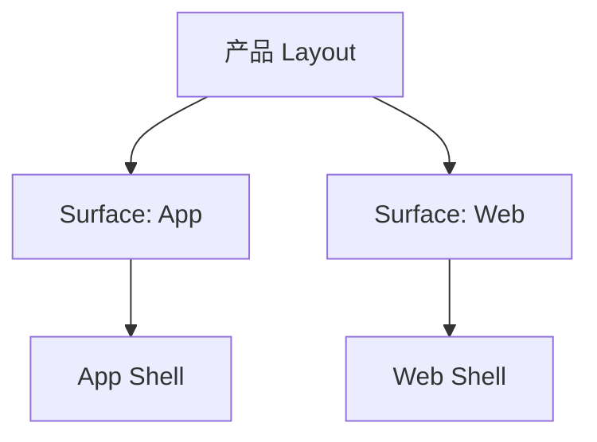

# Product Layout Draft 模板

> 输出路径：`product/development/layout/product-layout-draft.md`。本文档是项目级布局草案，用于用户确认布局假设与待确认项；确认后由 `product-layout-release` 生成 `product/release/layout/product-layout-release.md`，作为后续页面需求、Mock 内容、Design Release 和 Figma 生成前的正式结构约束。

# Product Layout Draft

## 0. 文档状态

| 字段 | 内容 |
|---|---|
| 文档版本 | Draft |
| 生成日期 |  |
| 来源文件 | `product/release/product-sitemap-release.md` |
| 来源章节 | `Sitemap 页面生成总表` |
| 当前输出文件 | `product/development/layout/product-layout-draft.md` |
| 适用范围 | APP / Web / SaaS / 小程序 / 后台系统 / 内容平台 / AI 工具等应用布局 |
| Layout 假设 / 待确认编号规则 | `LA-001` 起为布局假设；`LQ-001` 起为布局待确认 |

## 1. 产品布局总览

| 项目 | 内容 | 来源 / LA / LQ |
|---|---|---|
| 产品类型 |  |  |
| 应用 Surface |  |  |
| 主 Layout 形态 |  |  |
| 全局导航模型 |  |  |
| 页面层级模型 |  |  |
| 响应式 / 端形态策略 |  |  |
| 全局状态容器 |  |  |

## 2. Layout 架构图



## 3. Surface 与 Shell 定义

| Surface ID | Surface 名称 | 适用角色 | Shell 类型 | 全局区域 | 根页面入口 | 子页面呈现 | 例外页面 | 来源 / LA / LQ |
|---|---|---|---|---|---|---|---|---|
| SF-001 |  |  | bottom-tabs / sidebar / top-nav / split-pane / mini-program / admin-console / auth-only / other | top-nav / side-nav / bottom-tab / main-scroll / fixed-footer / modal-layer |  | push / modal / drawer / nested-route / new-page | 登录 / 引导 / 支付 / 分享页 |  |

## 4. 全局 Shell 区域规范

| Shell 区域ID | 区域名称 | 所属 Surface | 显示规则 | 内容槽位 | 尺寸 / 安全区 | 滚动关系 | 层级关系 | 状态变化 | 来源 / LA / LQ |
|---|---|---|---|---|---|---|---|---|---|
| SHELL-001 | Top Navigation |  |  | title / back / actions / search |  | fixed / sticky / scrolls-with-content |  | default / hidden / disabled / loading |  |
| SHELL-002 | Main Content |  |  | page-header / body / list / form / media / result |  | scroll-container |  | loading / empty / error / permission |  |
| SHELL-003 | Bottom Tab / Side Nav |  |  | nav-items / selected-state / badge |  | fixed |  | selected / hidden / disabled |  |

## 5. 页面模板库

| 模板ID | 模板名称 | 适用页面类型 | 必备区域 | 可选区域 | 默认父子层级 | 典型状态 | 响应式规则 | 来源 / LA / LQ |
|---|---|---|---|---|---|---|---|---|
| TPL-001 | 列表页模板 | list / index | shell + content-header + filter + list | empty / pagination / batch-action | Surface > Shell > Page > List | loading / empty / error | mobile stack, desktop split/filter sidebar |  |
| TPL-002 | 详情页模板 | detail | shell + title + detail-content | related-list / fixed-action | parent list > detail | loading / not-found / permission | mobile push, desktop side panel optional |  |
| TPL-003 | 表单页模板 | create / edit | shell + form + fixed-action | validation-summary / stepper | parent > form | validation / submitting / success | mobile full-width, desktop constrained form |  |

## 6. Sitemap 到 Layout 映射总表

| 生成顺序 | 页面ID | 父页面ID | 层级 | 页面名称 | 页面级MD文件 | Surface ID | Shell 类型 | 页面模板ID | 导航位置 | 子页面呈现方式 | 全局区域继承 | 响应式规则 | 例外说明 | 来源 / LA / LQ |
|---:|---|---|---|---|---|---|---|---|---|---|---|---|---|---|
| 10 |  |  |  |  |  | SF-001 |  | TPL-001 | root-tab / sidebar-item / top-nav / hidden | push / modal / drawer / nested | top-nav / main-scroll / bottom-tab |  |  |  |

## 7. 导航与路由规则

| 规则ID | 适用范围 | 规则 | 返回 / 关闭行为 | 当前态展示 | 权限影响 | 来源 / LA / LQ |
|---|---|---|---|---|---|---|
| NAV-001 |  |  |  |  |  |  |

## 8. 全局状态与边界 Layout

| 状态ID | 适用 Surface / 模板 | 状态类型 | Layout 表现 | 文案/媒体槽位 | 可恢复入口 | 来源 / LA / LQ |
|---|---|---|---|---|---|---|
| GL-STATE-001 |  | loading / empty / error / offline / permission / quota / payment |  |  |  |  |

## 9. 角色与权限对 Layout 的影响

| 角色 | 影响区域 | 显示 / 隐藏 / 禁用规则 | 替代 Layout | 来源 / LA / LQ |
|---|---|---|---|---|
|  |  |  |  |  |

## 10. 下游 Skill 使用规则

| 下游 Skill | 必须读取 | 使用方式 | 必须引用的 Layout 信息 |
|---|---|---|---|
| product-page-draft | product-layout-release + product-overview-release | 先确定页面 shell/template，再生成元素/状态/action/API | Surface ID / Shell / 模板ID / 导航位置 / 响应式规则 |
| product-page-mock-draft | product-layout-release + release page | 生成可见文案与 mock 内容时补齐 shell/nav/状态容器文案 | 全局区域 / 导航标签 / 页面标题 / 状态容器 |
| product-page-design-release | product-layout-release + release mock + design system | 生成 App Shell、Frame 层级、响应式与布局完整性审核 | Shell 区域 / 页面模板 / 父子层级 / 安全区 / scroll/fixed 关系 |

## 11. 布局假设与待确认统一清单

### 11.1 布局假设清单

| 假设ID | 假设内容 | 首次出现位置 | 影响范围 | 影响页面 / Surface / Shell | 置信度 | 用户确认状态 | Release 处理方式 |
|---|---|---|---|---|---|---|---|
| LA-001 |  |  | Surface / Shell / 模板 / 导航 / 响应式 |  | 高 / 中 / 低 | 待用户确认 / 已确认 / 已否定 / 已修改 | 确认为正式内容 / 删除 / 按用户修改替换 |

### 11.2 布局待确认清单

| 待确认ID | 待确认问题 | 首次出现位置 | 影响范围 | 影响页面 / Surface / Shell | 优先级 | 用户确认结果 | Release 处理方式 |
|---|---|---|---|---|---|---|---|
| LQ-001 |  |  | Surface / Shell / 模板 / 导航 / 响应式 |  | 高 / 中 / 低 | 待用户确认 / 已确认：... / 不需要 / 改为：... | 写入正式内容 / 删除 / 保留为风险 |

## 12. 用户补充描述

> 本章节必须保留在 Layout Draft 文档末尾，供用户用自然语言补充或修改全局 Shell、导航、页面模板、响应式规则、全局状态、角色/权限布局、页面层级呈现或 Sitemap 到 Layout 映射。`product-layout-release` 生成 release 版本时必须读取、分析并应用这里的内容。
> 如果没有补充，请保留“无”。

```text
无
```
