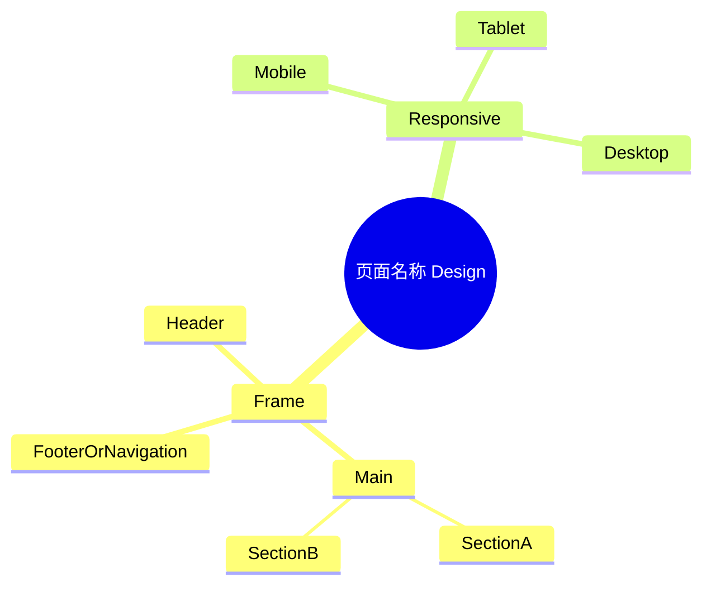

# 页面 Design Release 模板

> 输出路径：`product/release/design/<同名 release mock 文件>.md`。每次只生成一个页面。本文档描述页面展示内容与样式布局，不描述交互执行、埋点、接口、后端或业务处理逻辑。

# <页面名称> Design Release

## 0. 文档状态

| 字段 | 内容 |
|---|---|
| 文档版本 | Release |
| 生成日期 |  |
| 来源 Mock 文件 | `product/release/mock/<page>.md` |
| 设计约束目录 | `design/<design-system>/` |
| 当前输出文件 | `product/release/design/<page>.md` |
| 页面名称 |  |
| 内容范围 | 页面展示内容 + 视觉样式 + 布局结构 + 布局完整性审核 + AI 可读样式结构 |
| 不包含范围 | 交互执行 / 埋点 / 接口 / 后端 / 业务流程 / 实现代码 |

## 1. 页面设计综述

| 项目 | 内容 |
|---|---|
| 页面定位 |  |
| 目标阅读对象 | 设计师 / 产品 / 后续 AI 设计生成 agent / Figma Remote MCP agent |
| 视觉目标 |  |
| 信息层级 |  |
| 主要视觉焦点 |  |
| 设计系统应用摘要 |  |
| 布局完整性目标 | 页面区块、元素、层级、间距和响应式规则清晰，不出现堆叠、挤压、遮挡、裁切或层级错误 |

## 2. 设计约束提取

| 类型 | Token / 规则 | 取值 | 使用方式 | 来源文件 |
|---|---|---|---|---|
| color |  |  |  | DESIGN.md / tokens.json |
| typography |  |  |  | DESIGN.md / tokens.json |
| space |  |  |  | DESIGN.md / tokens.json |
| radius |  |  |  | DESIGN.md / tokens.json |
| shadow / elevation |  |  |  | DESIGN.md / tokens.json |
| breakpoint |  |  |  | DESIGN.md / tokens.json |

## 3. 页面结构图



## 4. 自然语言样式描述

### 4.1 整体画面

- 页面整体氛围：
- 背景与层级：
- 视觉重心：
- 阅读节奏：

### 4.2 关键区块叙述

| 区块ID | 区块名称 | 展示内容摘要 | 样式叙述 | 视觉优先级 | 设计决策 |
|---|---|---|---|---|---|
| S-001 |  |  |  | 高 / 中 / 低 |  |

## 5. 布局与区块样式表

| 区块ID | 来源 Mock 区块 / 元素 | Frame 层级 | 布局方式 | 尺寸 / 约束 | Padding | Gap | 背景 / 边框 / 阴影 | 圆角 | 对齐 | 溢出 / 换行规则 | 层级 / 覆盖规则 | 响应式变化 |
|---|---|---|---|---|---|---|---|---|---|---|---|---|
| S-001 |  | Page / Header / Main / Section / Group | vertical / horizontal / grid / overlay |  |  |  |  |  |  |  |  |  |

## 6. 元素级视觉定义

| 元素ID | 来源 Mock 元素 | 元素类型 | 展示内容 | 视觉角色 | 字体 / 字号 / 字重 | 颜色 Token | 背景 / 边框 | 尺寸 / 最小尺寸 | 父级容器 | 对齐 / 换行 / 截断 | 状态样式摘要 | Figma 节点建议 |
|---|---|---|---|---|---|---|---|---|---|---|---|---|
| E-001 |  | button / input / image / text / card / table / list / chart / nav / modal / toast / media / other |  | primary / secondary / content / support / warning |  |  |  |  |  |  |  |  |

## 7. 内容与样式绑定表

| 内容对象ID | 来源 Mock 内容 | 展示文案 / 媒体描述 | 内容来源类型 | 样式 Token 绑定 | 布局位置 | 备注 |
|---|---|---|---|---|---|---|
| C-001 |  |  | 静态 / 动态 | color / typography / space / radius / elevation |  |  |

## 8. 布局完整性审核

> 必须在保存前完成。若发现风险，先修正第 5、6、9、10、11 节中的布局规则，再在本表记录为“已解决”。不得把未解决的遮挡、挤压、堆叠、裁切或层级问题留给 Figma 生成阶段。

| 审核ID | 审核项 | 检查范围 | 风险判断 | 修正规则 / 约束 | 结果 |
|---|---|---|---|---|---|
| LQA-001 | 父子层级清晰 | Page / Header / Main / Section / Group / Element |  | 每个主要元素有唯一父级；Frame 层级与视觉层级一致 | 通过 / 已解决 |
| LQA-002 | 不发生非预期遮挡 | overlay / modal / badge / floating / media / nav |  | 仅允许明确命名的覆盖层；记录 z-index / layer order 与碰撞规则 | 通过 / 已解决 |
| LQA-003 | 不发生挤压或不可读换行 | 标题 / 按钮 / 表单 / 卡片 / 表格 / 导航 |  | 设置 min/max、wrap、truncate、stack、scroll 或改为列表布局 | 通过 / 已解决 |
| LQA-004 | 不发生裁切或隐藏控件 | 图片 / 表格 / 长文本 / 表单 / 弹层 |  | 明确 overflow、aspect ratio、scroll container、safe area 与空态尺寸 | 通过 / 已解决 |
| LQA-005 | 间距与对齐稳定 | 所有区块和组件 |  | Padding、Gap、Align、Grid columns 必须使用 token 或明确数值 | 通过 / 已解决 |
| LQA-006 | 响应式无冲突 | mobile / tablet / desktop / wide |  | 每个断点说明导航、网格、表格、按钮组、媒体和长文本如何变化 | 通过 / 已解决 |
| LQA-007 | Figma 生成可执行 | AI 可读样式结构 / Figma handoff |  | Auto Layout、constraints、resize、clip content、layer order 均可直接映射 | 通过 / 已解决 |

## 9. 状态展示样式

> 仅描述状态下用户看到的内容与样式，不描述触发条件、执行动作、接口或埋点。

| 状态ID | 来源 Mock 状态 | 状态类型 | 展示内容 | 视觉样式 | 色彩 / 图标 / 媒体处理 | 空间占位 | 可访问性说明 |
|---|---|---|---|---|---|---|---|
| STATE-001 |  | loading / empty / error / disabled / success / warning / limited / media-failed |  |  |  |  |  |

## 10. 响应式布局规则

| 断点 | 页面宽度范围 | Frame 布局 | 导航 / Header | 主内容布局 | 列表 / 表格 / 卡片变化 | 按钮组 / 表单变化 | 字体 / 间距调整 | 溢出 / 长内容处理 | 优先隐藏或折叠内容 |
|---|---|---|---|---|---|---|---|---|---|
| mobile |  |  |  |  |  |  |  |  |  |
| tablet |  |  |  |  |  |  |  |  |  |
| desktop |  |  |  |  |  |  |  |  |  |
| wide |  |  |  |  |  |  |  |  |  |

## 11. AI 可读样式结构

```yaml
page:
  id: "<page-id>"
  name: "<page-name>"
  source_mock: "product/release/mock/<page>.md"
  design_system: "design/<design-system>/"
  output: "product/release/design/<page>.md"
  canvas:
    background_token: ""
    max_width: ""
    responsive_breakpoints: []
    overflow_policy: ""
  frames:
    - id: "frame-root"
      name: "Page"
      type: "frame"
      layout: "vertical"
      padding: ""
      gap: ""
      fill_token: ""
      sizing:
        width: ""
        min_width: ""
        max_width: ""
        height: ""
        min_height: ""
      alignment:
        primary_axis: ""
        counter_axis: ""
        wrap: ""
      overflow:
        clip_content: false
        scroll_axis: ""
      layer_order: 0
      children: []
  components:
    - id: "component-001"
      source_element_id: ""
      type: ""
      content: ""
      tokens:
        typography: ""
        text_color: ""
        fill: ""
        radius: ""
        shadow: ""
      constraints:
        width: ""
        height: ""
        min_touch_target: ""
        min_width: ""
        max_width: ""
        overflow: ""
        text_wrap: ""
        text_truncation: ""
        layer_order: ""
      states:
        default: {}
        loading: {}
        empty: {}
        error: {}
        disabled: {}
  layout_integrity:
    overlap_policy: "no unintended overlap"
    compression_policy: ""
    clipping_policy: ""
    responsive_collision_rules: []
```

## 12. Figma Remote MCP 生成提示

| 项目 | 指令 |
|---|---|
| Frame 创建顺序 |  |
| Auto Layout 设置 |  |
| 尺寸约束 |  |
| 溢出 / 裁切设置 |  |
| 层级顺序 |  |
| Token 应用方式 |  |
| 组件分组 |  |
| 文本节点命名 |  |
| 媒体占位 |  |
| 响应式变体 |  |
| 布局审核要求 | 生成后检查无堆叠、挤压、遮挡、裁切、层级错误；如有问题必须调整 Frame / Auto Layout / Constraints 后再交付 |
| 生成时禁止事项 | 不生成交互原型、不生成埋点、不生成接口逻辑、不生成业务流程 |

## 13. 设计决策记录

| 决策ID | 决策内容 | 依据 | 影响范围 |
|---|---|---|---|
| DD-001 |  | 来源 Mock + 设计系统约束 |  |
