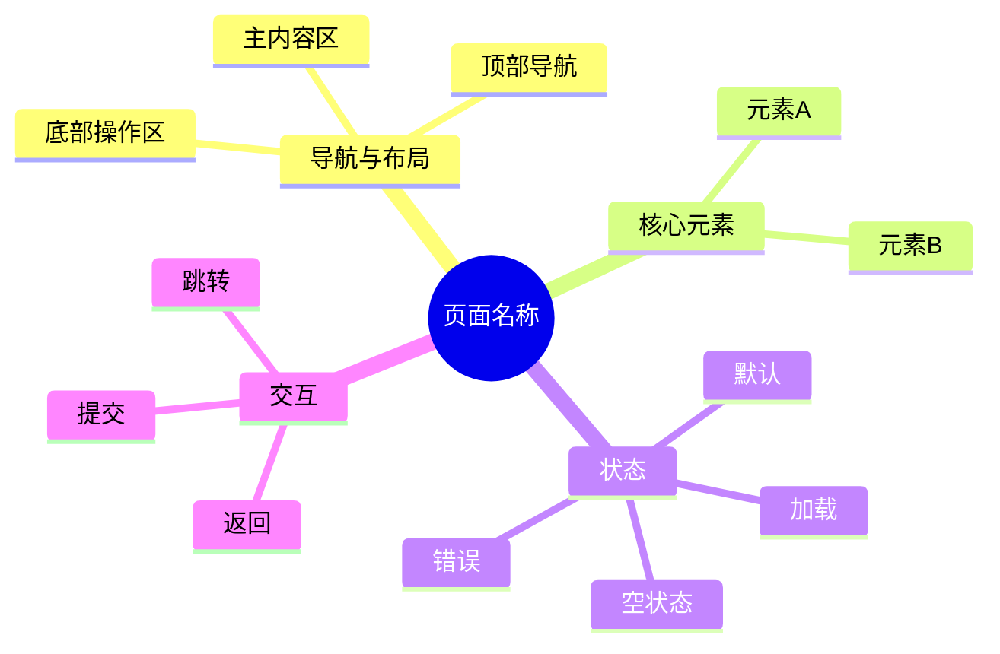

# 页面级 Draft MD 模板

> 输出路径必须与 `Sitemap 页面生成总表` 中当前页面行的 `页面级MD文件` 列完全一致。每次只生成一个页面。

# <页面名称>

## 0. 页面文档状态

- 文档版本：Draft
- 生成日期：
- 来源文件：`product/release/product-sitemap-release.md`
- 来源 Sitemap 行：
  - 生成顺序：
  - 页面ID：
  - 父页面ID：
  - 层级：
  - Surface：
  - Layout 区域：
  - 页面名称：
  - 页面类型：
  - Sitemap 页面级MD文件：
- 当前输出文件：与 `Sitemap 页面级MD文件` 完全一致
- 页面级假设 / 待确认编号规则：
  - 页面假设：`PA-001` 起，按首次出现顺序递增。
  - 页面待确认：`PQ-001` 起，按首次出现顺序递增。
  - 正文、表格、接口、状态、元素中出现的每个 `PA-*` / `PQ-*` 必须在 `页面假设与待确认统一清单` 中出现。

## 1. 页面目标与上下文

### 1.1 页面目标

- 页面目的：
- 用户目标：
- 业务目标：
- 页面成功标准：

### 1.2 页面入口与出口

| 类型 | 来源 / 去向 | 触发条件 | 传入 / 传出数据 | 备注 |
|---|---|---|---|---|
| 入口 |  |  |  |  |
| 出口 |  |  |  |  |

### 1.3 角色与权限

| 角色 | 是否可访问 | 权限条件 | 不满足时页面表现 | 相关 PA/PQ |
|---|---|---|---|---|
|  |  |  |  |  |

### 1.4 全局页面属性

| 属性 | 类型 | 来源 | 默认值 | 影响元素 / 状态 | 说明 |
|---|---|---|---|---|---|
|  |  | route / local state / global store / API / device / permission |  |  |  |

## 2. 页面结构思维导图

> Mermaid 内容必须与元素清单、状态矩阵、交互矩阵一致。



## 3. 页面布局与内容区块

| 区块ID | 区块名称 | 区块类型 | 展示条件 | 包含元素ID | 布局 / 样式定义 | 数据来源 | 相关 PA/PQ |
|---|---|---|---|---|---|---|---|
| S-001 |  | header / content / footer / modal / drawer / toast / overlay |  |  |  |  |  |

## 4. 页面元素清单

> 元素需覆盖按钮、下拉栏、表单、radio、checkbox、toggle、输入框、上传器、表格/列表、卡片、banner、音视频图片多媒体、弹窗、toast、tooltip、图表、导航等实际需要的元素。

| 元素ID | 元素名称 | 元素类型 | 所属区块 | 是否必需 | 展示条件 | 默认文案 / 内容 | 样式定义 | 数据绑定 | 相关 PA/PQ |
|---|---|---|---|---|---|---|---|---|---|
| E-001 |  | button / select / input / radio / checkbox / uploader / image / video / banner / list / card / modal / toast / chart / nav / other | S-001 | 是 / 否 |  |  | 尺寸、颜色、层级、对齐、间距、禁用样式 |  |  |

## 5. 元素状态矩阵

| 元素ID | 状态 | 触发条件 | 状态来源 | 样式定义 | 可执行动作 | 禁止动作 | 提示文案 / 反馈 | 恢复条件 | 相关 PA/PQ |
|---|---|---|---|---|---|---|---|---|---|
| E-001 | 默认 / 加载 / 启用 / 禁用 / 聚焦 / 选中 / 成功 / 警告 / 错误 / 空 / 无权限 / 离线 / 额度不足 / 需支付 |  | global 属性 / 表单校验 / 接口返回 / 权限 / 会员状态 / 设备能力 |  |  |  |  |  |  |

## 6. 交互 Action 与执行效果

| ActionID | 触发元素ID | 交互名称 | 用户动作 | 前置条件 | 校验规则 | 执行动作 | 成功结果 | 失败结果 | 页面跳转 / 状态变化 | 埋点事件ID | 埋点事件名称 | 不埋点原因 | 相关 PA/PQ |
|---|---|---|---|---|---|---|---|---|---|---|---|---|---|
| ACT-001 | E-001 |  | 点击 / 输入 / 选择 / 拖拽 / 上传 / 长按 / 滑动 / 播放 / 暂停 |  |  | 本地状态更新 / API 调用 / 导航 / 打开弹窗 / 触发系统能力 |  |  |  | EVT-001 |  | 如不埋点需说明原因 |  |

## 7. 埋点事件统计设计

> 本章节用于描述页面中所有需要统计的事件。除 Action 表中引用的事件外，还需要补充页面曝光、关键元素展示、表单校验失败、接口成功/失败、业务转化、异常与退出等事件。
> 本章节为必填。每个页面至少包含 1 个页面曝光事件；每个主按钮、提交动作、API 触发动作、支付/额度/权限关键动作必须有明确的 `埋点事件ID`。

### 7.1 埋点事件总表

| 埋点事件ID | 事件名称 | 事件类型 | 关联元素ID / ActionID | 触发时机 | 统计次数口径 | 去重规则 | 上报时机 | 关键属性 | 成功 / 失败归因 | 漏斗阶段 | 相关 PA/PQ |
|---|---|---|---|---|---|---|---|---|---|---|---|
| EVT-001 |  | page_view / impression / click / submit / validation_error / api_success / api_failure / media_play / media_complete / payment_prompt / quota_prompt / exit | E-001 / ACT-001 | 页面进入 / 元素曝光 / 点击 / 接口返回 / 表单校验失败 / 页面退出 | 每次触发计 1 次 / 每页面会话计 1 次 / 每对象 ID 计 1 次 / 去重后计 1 次 | 按 sessionId + pageId + objectId / requestId / actionId 去重 | 实时 / 批量 / 页面退出 / 接口返回后 | page_id、page_name、element_id、action_id、user_role、membership_status、result_code、object_id、source_page |  |  |  |

### 7.2 埋点事件属性定义

| 属性名 | 类型 | 必填 | 来源 | 示例值 | 使用事件ID | 说明 |
|---|---|---|---|---|---|---|
| page_id | string | 是 | Sitemap 页面ID | U-020 | EVT-001 | 页面唯一标识 |
| page_name | string | 是 | Sitemap 页面名称 | 首页 | EVT-001 | 页面名称 |
| element_id | string | 否 | 元素清单 | E-001 | EVT-001 | 触发元素 |
| action_id | string | 否 | Action 表 | ACT-001 | EVT-001 | 触发动作 |
| result | enum | 否 | 本地状态 / 接口返回 | success / failure | EVT-001 | 行为结果 |

### 7.3 关键统计次数说明

- 页面曝光次数：
  - 事件ID：
  - 计数口径：
  - 去重规则：
- 关键按钮点击次数：
  - 事件ID：
  - 计数口径：
  - 去重规则：
- 表单提交尝试次数：
  - 事件ID：
  - 计数口径：
  - 成功 / 失败拆分：
- 表单校验失败次数：
  - 事件ID：
  - 计数口径：
  - 需记录的失败字段：
- 接口调用成功 / 失败次数：
  - 事件ID：
  - 计数口径：
  - 需记录的错误码：
- 页面核心转化完成次数：
  - 事件ID：
  - 计数口径：
  - 漏斗归因：
- 页面退出 / 中断次数：
  - 事件ID：
  - 计数口径：
  - 退出来源：
- 多媒体播放 / 完播次数（如适用）：
  - 事件ID：
  - 计数口径：
  - 完播定义：

## 8. 数据结构与接口定义

### 8.1 页面数据模型

| 数据对象 | 字段 | 类型 | 必填 | 来源 | 默认值 | 使用位置 | 说明 |
|---|---|---|---|---|---|---|---|
|  |  | string / number / boolean / enum / array / object / file | 是 / 否 | API / route / store / local / device |  | 元素ID / ActionID |  |

### 8.2 接口清单

| API ID | 接口名称 | 方法 | 路径 | 触发 ActionID | 请求数据结构 | 返回数据结构 | 成功处理 | 失败处理 | 相关 PA/PQ |
|---|---|---|---|---|---|---|---|---|---|
| API-001 |  | GET / POST / PUT / PATCH / DELETE |  | ACT-001 |  |  |  |  |  |

### 8.3 请求 / 返回 JSON 示例

#### API-001 请求

```json
{
  "field": "value"
}
```

#### API-001 成功返回

```json
{
  "code": 0,
  "message": "ok",
  "data": {}
}
```

#### API-001 失败返回

```json
{
  "code": "ERROR_CODE",
  "message": "错误说明",
  "data": null
}
```

## 9. 边界状态与错误处理

| 场景ID | 场景类型 | 触发条件 | 页面表现 | 元素表现 | 用户可执行操作 | 系统处理 | 兜底文案 | 相关 PA/PQ |
|---|---|---|---|---|---|---|---|---|
| EDGE-001 | 空状态 / 加载超时 / 网络错误 / 权限不足 / 参数缺失 / 接口失败 / 数据冲突 / 额度不足 / 支付失败 / 文件异常 / 设备能力缺失 |  |  |  |  |  |  |  |

## 10. 多媒体与资源

| 资源ID | 资源类型 | 使用位置 | 来源 | 格式 / 尺寸 | 加载状态 | 失败降级 | 可访问性说明 | 相关 PA/PQ |
|---|---|---|---|---|---|---|---|---|
| M-001 | image / video / audio / file / icon / animation | 元素ID | 本地 / CDN / API / 用户上传 / 系统生成 |  |  |  |  |  |

## 11. 页面假设与待确认统一清单

> 本章节用于用户统一确认页面假设与待确认项。正文、表格、接口、状态中出现的所有 `PA-*` / `PQ-*` 必须在这里逐条列出。

### 11.1 页面假设清单

| 假设ID | 假设内容 | 首次出现位置 | 影响范围 | 影响元素 / Action / API / 埋点事件 | 置信度 | 用户确认状态 | Release 处理方式 |
|---|---|---|---|---|---|---|---|
| PA-001 |  | 章节 / 表格行 / 元素ID / ActionID / API ID / 埋点事件ID | 元素 / 状态 / 交互 / 接口 / 数据 / 样式 / 错误处理 / 埋点 |  | 高 / 中 / 低 | 待用户确认 / 已确认 / 已否定 / 已修改 | 确认为正式内容 / 删除 / 按用户修改替换 |

### 11.2 页面待确认清单

| 待确认ID | 待确认问题 | 首次出现位置 | 影响范围 | 影响元素 / Action / API / 埋点事件 | 优先级 | 用户确认结果 | Release 处理方式 |
|---|---|---|---|---|---|---|---|
| PQ-001 |  | 章节 / 表格行 / 元素ID / ActionID / API ID / 埋点事件ID | 元素 / 状态 / 交互 / 接口 / 数据 / 样式 / 错误处理 / 埋点 |  | 高 / 中 / 低 | 待用户确认 / 已确认：... / 不需要 / 改为：... | 写入正式内容 / 删除 / 保留为风险 |

## 12. 用户补充描述

> 本章节必须保留在页面 Draft 文档末尾，供用户用自然语言补充或修改当前页面需求。`product-page-release` 生成 release 版本时必须读取、分析并应用这里的内容。
> 如果没有补充，请保留“无”。

```text
无
```
