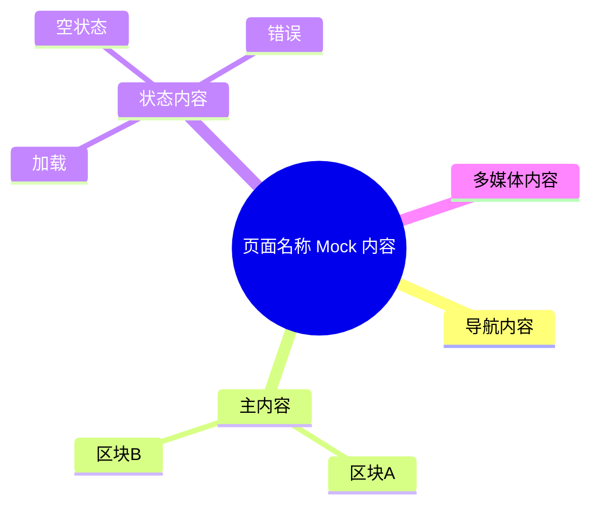

# 页面 Mock Draft 模板

> 输出路径：`product/development/mock/<同名 release page 文件>.md`。每次只生成一个页面。本文档只描述页面展示内容与 mock 数据，不描述交互执行、埋点、接口调用或业务执行逻辑。

# <页面名称>

## 0. Mock 文档状态

- 文档版本：Draft
- 生成日期：
- 来源页面文件：`product/release/pages/<page>.md`
- 当前输出文件：`product/development/mock/<page>.md`
- 页面名称：
- 内容范围：页面展示内容 / mock 数据 / 多状态文案 / 静态或动态来源标注
- 不包含范围：交互动作执行、埋点逻辑、接口定义、业务处理逻辑
- 必须对照的来源表：
  - `页面布局与内容区块`
  - `页面元素清单`
  - `元素状态矩阵`
  - `交互 Action 与执行效果`
- Mock 假设 / 待确认编号规则：
  - Mock 假设：`MA-001` 起，按首次出现顺序递增。
  - Mock 待确认：`MQ-001` 起，按首次出现顺序递增。
  - 正文和表格中出现的每个 `MA-*` / `MQ-*` 必须在 `Mock 假设与待确认统一清单` 中出现。

## 1. 页面内容概览

| 项目 | 内容 |
|---|---|
| 页面定位 |  |
| 主要用户 |  |
| 核心展示目标 |  |
| 内容语气 | 专业 / 轻松 / 鼓励 / 警示 / 中性 |
| 主要动态数据来源 | 接口返回 / 用户资料 / 本地缓存 / 系统状态 / 会员状态 / 上传文件 / 生成结果 |

## 2. 来源对照矩阵

> 本章节用于证明 mock 内容严格来自 release page 的关键页面定义表。不得只凭概要自由生成。

| 来源表 | 来源行ID | 来源名称 / 状态 / Action | 是否已映射 | 映射到 Mock 章节 | 映射对象ID | 未映射原因 | 相关 MA/MQ |
|---|---|---|---|---|---|---|---|
| 页面布局与内容区块 | S-001 |  | 是 / 否 | 3. 区块级内容描述 | S-001 |  |  |
| 页面元素清单 | E-001 |  | 是 / 否 | 4. 元素内容清单 | E-001 |  |  |
| 元素状态矩阵 | E-001 / 默认 |  | 是 / 否 | 8. 状态文案与内容差异 | STATE-001 |  |  |
| 交互 Action 与执行效果 | ACT-001 |  | 是 / 否 | 9. Action 可见内容映射 | AM-001 | 如无用户可见内容需说明 |  |

## 3. 页面内容结构图



## 4. 区块级内容描述

| 区块ID | 来源区块ID | 区块名称 | 展示目的 | 主要内容 | 内容来源类型 | 动态来源说明 | 状态差异 | 相关 MA/MQ |
|---|---|---|---|---|---|---|---|---|
| S-001 | S-001 |  |  |  | 静态 / 动态 | 接口返回 / 用户资料 / 本地缓存 / 系统状态 / 权限状态 / 会员状态 / 上传文件 / 生成结果 |  |  |

## 5. 元素内容清单

| 元素ID | 来源元素ID | 元素名称 | 元素类型 | 所属区块 | 展示内容 | 内容来源类型 | 动态来源说明 | 默认状态内容 | 空状态内容 | 加载状态内容 | 错误状态内容 | 禁用 / 无权限内容 | 相关 MA/MQ |
|---|---|---|---|---|---|---|---|---|---|---|---|---|---|
| E-001 | E-001 |  | button / input / select / radio / checkbox / toggle / uploader / image / video / audio / banner / card / list / table / modal / toast / tooltip / nav / chart / other | S-001 |  | 静态 / 动态 |  |  |  |  |  |  |  |

## 6. 表单与选项 Mock 内容

| 表单ID | 字段 / 控件ID | 字段名称 | 控件类型 | Label 文案 | Placeholder / 默认值 | 选项内容 | 帮助说明 | 校验提示展示文案 | 内容来源类型 | 动态来源说明 | 相关 MA/MQ |
|---|---|---|---|---|---|---|---|---|---|---|---|
| FORM-001 | E-001 |  | input / textarea / select / radio / checkbox / toggle / date / upload |  |  |  |  |  | 静态 / 动态 |  |  |

## 7. 列表 / 卡片 / 表格 Mock 数据

| 数据组ID | 展示组件ID | 数据项名称 | Mock 数据条目 | 字段展示文案 | 内容来源类型 | 动态来源说明 | 空状态替代内容 | 相关 MA/MQ |
|---|---|---|---|---|---|---|---|---|
| DATA-001 | E-001 |  | 1.  |  | 静态 / 动态 |  |  |  |

## 8. 图片 / 音视频 / 多媒体内容

| 资源ID | 资源类型 | 使用位置 | 展示内容描述 | 替代文本 / 标题 | Caption / 说明文案 | 缩略图 / 封面描述 | 不同状态展示 | 内容来源类型 | 动态来源说明 | 相关 MA/MQ |
|---|---|---|---|---|---|---|---|---|---|---|
| M-001 | image / icon / illustration / video / audio / file-preview / animation | 元素ID / 区块ID |  |  |  |  | 加载 / 失败 / 空 / 权限不足 | 静态 / 动态 |  |  |

## 9. 状态文案与内容差异

| 状态ID | 来源元素ID | 来源状态 | 状态类型 | 触发场景说明 | 页面展示文本 | 主要元素内容变化 | 图片 / 多媒体变化 | 用户可见提示 | 内容来源类型 | 动态来源说明 | 相关 MA/MQ |
|---|---|---|---|---|---|---|---|---|---|---|---|
| STATE-001 | E-001 | 默认 | 默认 / 加载 / 空状态 / 成功 / 错误 / 禁用 / 无权限 / 离线 / 需支付 / 额度不足 / 数据过期 |  |  |  |  |  | 静态 / 动态 |  |  |

## 10. Action 可见内容映射

> 仅提取 Action 对用户可见内容的影响，例如按钮文案、toast、弹窗文案、成功/失败反馈、跳转入口名称、状态切换后的展示文案。不得描述执行动作、接口调用、埋点或业务处理流程。

| 映射ID | 来源ActionID | 触发元素ID | Action 名称 | 用户可见内容变化 | 成功可见文案 | 失败可见文案 | 跳转 / 弹窗 / Toast 展示内容 | 内容来源类型 | 动态来源说明 | 相关 MA/MQ |
|---|---|---|---|---|---|---|---|---|---|---|
| AM-001 | ACT-001 | E-001 |  |  |  |  |  | 静态 / 动态 |  |  |

## 11. 内容来源汇总

| 内容对象 | 静态内容 | 动态内容 | 动态来源说明 | 是否需要用户确认 |
|---|---|---|---|---|
|  |  |  | 接口返回 / 用户资料 / 本地缓存 / 系统状态 / 权限状态 / 会员状态 / 上传文件 / 生成结果 | 是 / 否 |

## 12. Mock 假设与待确认统一清单

> 本章节用于用户统一确认。正文和表格中出现的所有 `MA-*` / `MQ-*` 必须在这里逐条列出。

### 12.1 Mock 假设清单

| 假设ID | 假设内容 | 首次出现位置 | 影响范围 | 影响区块 / 元素 / 内容对象 | 置信度 | 用户确认状态 | Release 处理方式 |
|---|---|---|---|---|---|---|---|
| MA-001 |  | 章节 / 表格行 / 元素ID / 资源ID | 文案 / 图片 / 音视频 / 表单选项 / 状态文案 / Mock 数据 |  | 高 / 中 / 低 | 待用户确认 / 已确认 / 已否定 / 已修改 | 确认为正式内容 / 删除 / 按用户修改替换 |

### 12.2 Mock 待确认清单

| 待确认ID | 待确认问题 | 首次出现位置 | 影响范围 | 影响区块 / 元素 / 内容对象 | 优先级 | 用户确认结果 | Release 处理方式 |
|---|---|---|---|---|---|---|---|
| MQ-001 |  | 章节 / 表格行 / 元素ID / 资源ID | 文案 / 图片 / 音视频 / 表单选项 / 状态文案 / Mock 数据 |  | 高 / 中 / 低 | 待用户确认 / 已确认：... / 不需要 / 改为：... | 写入正式内容 / 删除 / 保留为风险 |

## 13. 用户补充描述

> 本章节必须保留在 Mock Draft 文档末尾，供用户用自然语言补充或修改当前页面的展示文案、表单选项、图片/音视频描述、Mock 数据、状态文案、静态/动态来源标注或可访问性文本。`product-page-mock-release` 生成 release 版本时必须读取、分析并应用这里的内容。
> 如果没有补充，请保留“无”。

```text
无
```
