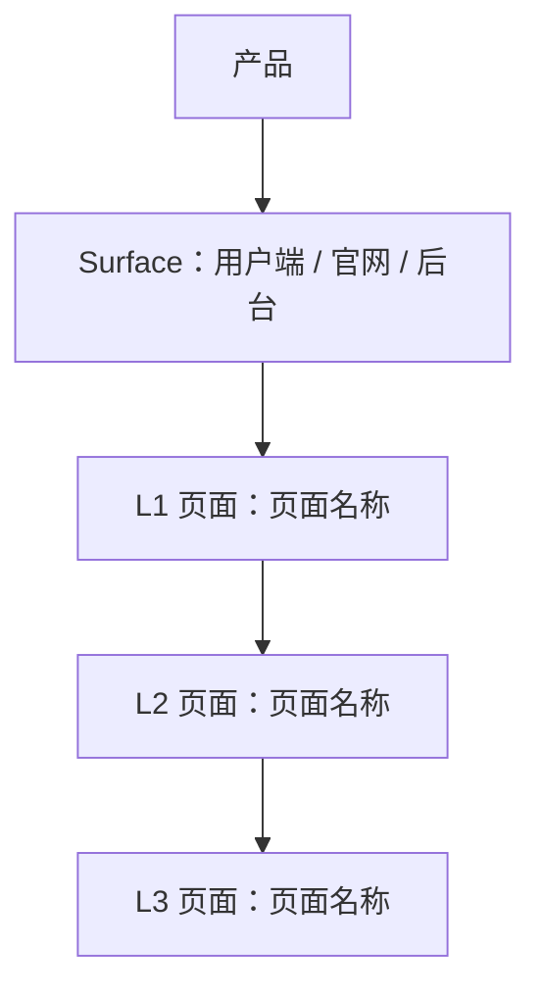

# 产品综述文档模板

> 使用方式：复制本结构生成 `product/development/product-overview-draft.md`。不确定内容必须标记为带 ID 的 `假设 A-xxx` 或 `待确认 Q-xxx`，并在统一清单中汇总。文档末尾必须保留 `用户补充描述`，供用户填写自然语言修改。

## 0. 文档状态

- 文档版本：Draft / Release
- 生成日期：
- 产品名称：
- 输入来源：
- 当前结论可信度：高 / 中 / 低
- 假设 / 待确认编号规则：
  - 假设：`A-001` 起，按首次出现顺序递增。
  - 待确认：`Q-001` 起，按首次出现顺序递增。
  - 正文、表格、Sitemap 中出现的每个 `A-*` / `Q-*` 必须在 `假设与待确认统一清单` 中出现。

## 1. 产品综合介绍

### 1.1 产品定位

- 产品类型：站点 / App / SaaS / 小程序 / 后台系统 / 内容平台 / AI 工具 / 其他
- 一句话定位：
- 核心价值：
- 目标用户：
- 使用场景：

### 1.2 核心业务目标

- 业务目标 1：
- 业务目标 2：
- 业务目标 3：
- 成功指标（引用 A-xxx / Q-xxx，如有）：

### 1.3 核心用户路径

1. 路径名称：
   - 触发入口：
   - 关键步骤：
   - 完成状态：
   - 失败 / 异常状态：

### 1.4 页面范围

- MVP 页面范围：
- 非 MVP / 后续页面范围：
- 不包含范围：

### 1.5 功能范围

- 核心功能：
- 支撑功能：
- 管理功能：
- 集成能力（支付 / 通知 / 第三方服务 / AI / 数据导入导出等）：

### 1.6 角色与权限

| 角色 | 角色说明 | 可访问范围 | 关键权限 | 假设 / 待确认ID |
|---|---|---|---|---|
|  |  |  |  |  |

### 1.7 关键操作

| 操作 | 操作角色 | 所属页面 / 模块 | 输入 | 输出 | 规则 / 限制 |
|---|---|---|---|---|---|
|  |  |  |  |  |  |

### 1.8 商业化与运营能力

- 商业化模式（引用 A-xxx / Q-xxx，如有）：
- 订阅 / 会员：
- 支付 / 退款：
- 通知渠道：
- 审核机制：
- 管理后台：
- 数据分析：
- 相关假设 / 待确认ID：

## 2. Sitemap / 信息架构

### 2.1 主要布局形态 Layout

- Layout 类型：
- 全局导航：
- 全局操作区：
- 登录态 / 未登录态差异：
- 多端 / 多角色布局差异：
- Surface 划分：
- Sitemap 生成原则：
  - 表格为后续页面级 skill 的唯一清单来源。
  - 每一行对应一个需要生成或确认的页面 / 子页面 / 子视图。
  - `页面ID`、`父页面ID`、`层级`、`生成顺序` 必须稳定、完整、可机读。

### 2.2 Sitemap 可视化

> 使用 Mermaid 展示与下方表格一致的父子层级。不要在图中加入表格不存在的页面。



### 2.3 Sitemap 页面生成总表

> 这是后续页面级子 skill 的主输入。必须完整、具体、可执行。每行对应一个页面级 md 生成任务或一个明确的子视图任务。

| 生成顺序 | 页面ID | 父页面ID | 层级 | Surface | Layout 区域 | 页面名称 | 页面类型 | 页面级MD文件 | 面向角色 | 对应功能 | 功能说明 | 关键操作 | 关键数据 / 内容 | 状态与边界 | 权限 / 业务规则 | 依赖页面 / 对象 | 来源 / 假设ID / 待确认ID |
|---:|---|---|---|---|---|---|---|---|---|---|---|---|---|---|---|---|---|
| 10 | U-010 | ROOT | L1 | 用户端 | 主导航 |  | 首页 / 工作台 / 列表 / 详情 / 表单 / 设置 / 审核 / 支付 / 管理 | product/development/pages/010-page-name.md |  |  |  |  |  | 空状态 / 加载 / 错误 / 无权限 / 待审核 / 需支付 |  |  | 来源：用户描述 / 文档；A-001；Q-001 |
| 20 | U-010-010 | U-010 | L2 | 用户端 | 内容区 |  |  | product/development/pages/020-page-name.md |  |  |  |  |  |  |  |  |  |
| 30 | U-010-010-010 | U-010-010 | L3 | 用户端 | 弹窗 / 抽屉 / 独立页 / Tab |  |  | product/development/pages/030-page-name.md |  |  |  |  |  |  |  |  |  |

### 2.4 分 Surface 层级清单

> 用嵌套列表辅助人工阅读，但不得替代表格。每个列表项必须带页面ID。

#### Surface A：

- Layout：
- 页面树：
  - `[页面ID] 页面名称`
    - 对应功能：
    - 页面级MD文件：
    - 子页面：
      - `[页面ID] 页面名称`
        - 对应功能：
        - 页面级MD文件：
        - 子页面：
          - `[页面ID] 页面名称`
            - 对应功能：
            - 页面级MD文件：

#### Surface B（如有）：

- Layout：
- 页面树：
  - `[页面ID] 页面名称`
    - 对应功能：
    - 页面级MD文件：
    - 子页面：
      - `[页面ID] 页面名称`
        - 对应功能：
        - 页面级MD文件：

### 2.5 页面生成队列

> 按 `生成顺序` 列出，供后续自动化逐条调用页面级 skill。

| 生成顺序 | 页面ID | 页面名称 | 父页面ID | 页面级MD文件 | 生成该页面前需要确认 / 依赖ID |
|---:|---|---|---|---|---|
| 10 |  |  |  |  | A-xxx / Q-xxx |

### 2.6 页面依赖与数据对象

| 页面 | 依赖对象 | 上游入口 | 下游页面 / 操作 | 权限依赖 | 假设 / 待确认ID |
|---|---|---|---|---|---|
|  |  |  |  |  |  |

### 2.7 Sitemap 完整性自检

| 检查项 | 结论 | 缺口 / 假设ID / 待确认ID |
|---|---|---|
| 每个核心功能是否至少有一个页面承载 | 是 / 否 |  |
| 每个角色是否有入口和权限边界 | 是 / 否 |  |
| 关键实体是否覆盖列表 / 详情 / 新建 / 编辑 / 删除或说明不需要 | 是 / 否 |  |
| 支付 / 订阅 / 通知 / 审核 / 管理 / 数据分析是否覆盖或明确排除 | 是 / 否 |  |
| 表格、分 Surface 清单、Mermaid 图是否页面一致 | 是 / 否 |  |
| 页面级MD文件路径是否唯一 | 是 / 否 |  |

## 3. 输入来源摘录

- 用户自然语言描述：
- 上传 / 引用文档：
- 关键证据与摘录：

## 4. 后续生成建议

- 推荐优先生成的页面级文档：
- 需要先由用户确认的内容（列出 Q-xxx / A-xxx）：
- Release 版生成条件：

## 5. 假设与待确认统一清单

> 本章节用于用户统一确认。正文、表格、Sitemap 中出现的所有 `A-*` / `Q-*` 必须在这里逐条列出；这里没有列出的 ID 不能出现在正文中。

### 5.1 假设清单

| 假设ID | 假设内容 | 首次出现位置 | 影响范围 | 影响页面ID | 置信度 | 用户确认状态 | Release 处理方式 |
|---|---|---|---|---|---|---|---|
| A-001 |  | 章节 / 表格行 / 页面ID | 产品定位 / 功能范围 / Sitemap / 权限 / 商业化 / 其他 |  | 高 / 中 / 低 | 待用户确认 / 已确认 / 已否定 / 已修改 | 确认为正式内容 / 删除 / 按用户修改替换 |

### 5.2 待确认清单

| 待确认ID | 待确认问题 | 首次出现位置 | 影响范围 | 影响页面ID | 优先级 | 用户确认结果 | Release 处理方式 |
|---|---|---|---|---|---|---|---|
| Q-001 |  | 章节 / 表格行 / 页面ID | 产品定位 / 功能范围 / Sitemap / 权限 / 商业化 / 其他 |  | 高 / 中 / 低 | 待用户确认 / 已确认：... / 不需要 / 改为：... | 写入正式内容 / 删除 / 保留为风险 |

### 5.3 Release 生成前检查

| 检查项 | 结论 | 说明 |
|---|---|---|
| 正文中所有 `A-*` 是否已进入假设清单 | 是 / 否 |  |
| 正文中所有 `Q-*` 是否已进入待确认清单 | 是 / 否 |  |
| 所有高优先级 `Q-*` 是否已有用户确认结果 | 是 / 否 |  |
| 被用户否定的假设是否已从正文和 Sitemap 中移除或替换 | 是 / 否 |  |
| Release 版是否不再保留 `待用户确认` 状态 | 是 / 否 |  |

## 6. 用户补充描述

> 本章节必须保留在产品综述 Draft 文档末尾，供用户用自然语言补充或修改产品范围、Sitemap、角色权限、商业化、支付、通知、审核、后台管理、页面层级或页面生成路径。`product-sitemap-overview` 生成 release 版本时必须读取、分析并应用这里的内容。
> 如果没有补充，请保留“无”。

```text
无
```
